# Design Document: Internal Ticketing System

## Overview

The Internal Ticketing System is a locally hosted web portal that enables business users to submit, track, and manage service requests, with a two-tier approval workflow before tickets reach IT. Every approved ticket is automatically synchronized to a JIRA project ("Business_Backlog"), ensuring IT teams work from their existing tooling. The system supports five user roles with distinct permissions, a full ticket lifecycle with re-open capability, role-scoped dashboards, in-portal and email notifications, and a comprehensive audit trail.

**Tech Stack:**
- Frontend: React (React Router, Axios)
- Backend: Python / FastAPI
- Database: SQLite (local file)
- JIRA: REST API v3
- OS: Windows Server 2012 / Windows 11 Pro

---

## Architecture

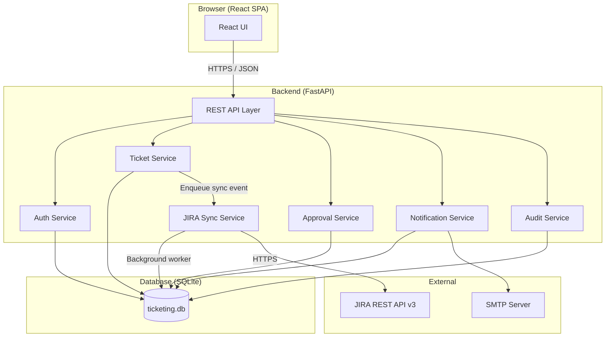

**Key architectural decisions:**
- Single-process FastAPI application with an in-process background worker for JIRA sync (APScheduler or asyncio task queue). Keeps the PoC simple while remaining extractable to a separate service later.
- JIRA sync uses a pluggable adapter pattern (see JIRA Sync section) so Azure DevOps can be added without re-architecture.
- SQLite is sufficient for PoC single-user/small-team load; the ORM layer (SQLAlchemy) allows migration to PostgreSQL for production.
- All API routes are protected by JWT-based session tokens; the frontend stores the token in an httpOnly cookie.

---

## Components and Interfaces

### Frontend (React SPA)

| Component | Responsibility |
|---|---|
| `LoginPage` | Credential form, forgot-password link |
| `TicketListPage` | Role-scoped ticket list with filters |
| `TicketDetailPage` | Full ticket view: status, comments, history, JIRA link |
| `SubmitTicketPage` | Submission form (title, description, department, urgency, cost, manager, attachments) |
| `ApprovalQueuePage` | Manager / Director pending approvals |
| `AdminPage` | User management, department list, audit trail, system health |
| `DashboardPage` | Role-scoped summary counts and charts |
| `NotificationBell` | In-portal notification feed (bell icon) |
| `PasswordResetPage` | Request reset / set new password |

All API calls go through an Axios instance configured with the base URL and automatic JWT header injection. A 401 response triggers redirect to login.

### Backend API (FastAPI)

Organized into routers:
- `/auth` — login, logout, password reset
- `/tickets` — CRUD, status transitions, comments, attachments
- `/approvals` — approval/rejection actions
- `/users` — user management (Admin only)
- `/departments` — department list management (Admin only)
- `/notifications` — list/mark-read for in-portal feed
- `/audit` — audit trail queries (Admin only)
- `/sync` — sync health endpoint
- `/admin` — system health, soft-delete

### JIRA Sync Service

An in-process background worker that:
1. Polls a `sync_queue` table every 10 seconds for pending sync events.
2. Dispatches each event to the configured adapter (JIRA by default).
3. Retries failed events up to 3 times with exponential back-off.
4. Marks events as `failed` after exhausting retries and sets a `sync_failed` flag on the ticket.

### Notification Service

Handles both channels:
- **Email**: Uses Python `smtplib` / `email` to send plain-text emails with a direct ticket link.
- **In-portal**: Writes `Notification` rows to the database; the frontend polls `/notifications` on page focus.

### Audit Service

Every service method that mutates a ticket, approval, comment, or user record calls `AuditService.record(...)` which writes an immutable `AuditLog` row. No UPDATE or DELETE is ever issued against `audit_log`.

---

## Data Models

### Entity Relationship Diagram


### Key Field Notes

- `TICKET.urgency`: submitter-set field (Low / Medium / High / Critical). Separate from `priority` which is IT-assigned.
- `TICKET.director_approval_required`: computed at submission time — true if `cost > 0` OR `urgency IN ('High', 'Critical')`.
- `TICKET.status`: one of `Pending | Approved | In Review | In Progress | Resolved | Closed | Rejected | Removed`.
- `APPROVAL.approver_role`: `Manager` or `Director`. Sequential — Director row is only created after Manager approves.
- `APPROVAL.deadline`: set to `created_at + 48h`; a background job checks for expired approvals and auto-escalates.
- `COMMENT.is_internal`: when true, hidden from Business User, Manager, Director.
- `AUDIT_LOG`: append-only; no role may UPDATE or DELETE rows.
- `SYNC_QUEUE.status`: `pending | in_progress | success | failed`.

---

## Ticket Lifecycle State Machine

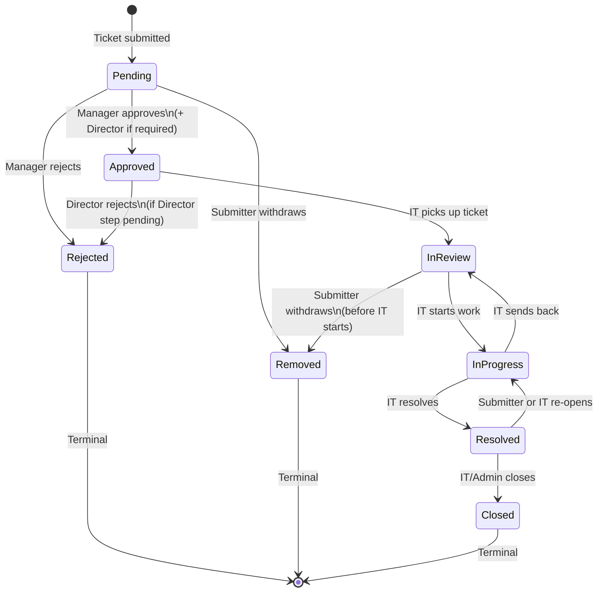

**Transition rules:**
- `Pending → Approved`: requires Manager approval (and Director approval if `director_approval_required = true`).
- `Pending → Rejected`: Manager rejects; ticket never reaches Director or IT.
- `Approved → Rejected`: Director rejects (only when Director step is pending).
- `Pending / In Review → Removed`: only the original submitter may trigger this.
- `Resolved → In Progress`: re-open; notifies IT team.
- `Closed`: terminal — no transitions out.
- IT Users may move tickets through `Approved → In Review → In Progress → Resolved → Closed`.
- IT Users may also override `priority` at any point (syncs to JIRA).

---

## Approval Flow

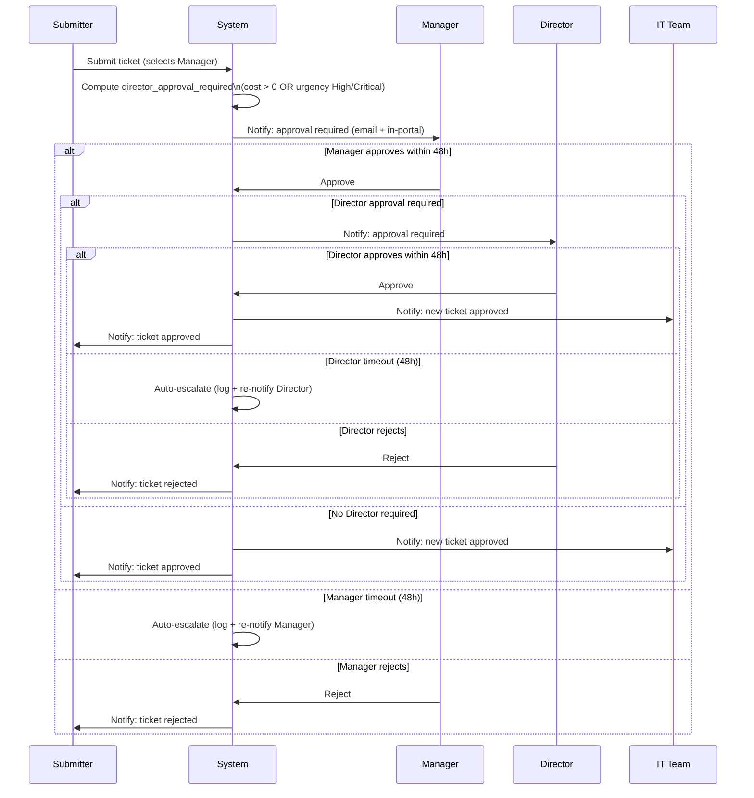

**Auto-escalation on 48h timeout:**
A background job (runs every 15 minutes) checks `APPROVAL` rows where `deadline < now()` and `decision IS NULL`. It logs an audit entry and re-sends the notification to the approver. For the PoC, escalation means re-notification; a production enhancement could route to a backup approver.

---

## API Endpoint Design

### Authentication

| Method | Path | Description | Roles |
|---|---|---|---|
| POST | `/auth/login` | Authenticate, return JWT cookie | Public |
| POST | `/auth/logout` | Invalidate session | Authenticated |
| POST | `/auth/password-reset/request` | Send reset email | Public |
| POST | `/auth/password-reset/confirm` | Set new password via token | Public |

### Tickets

| Method | Path | Description | Roles |
|---|---|---|---|
| GET | `/tickets` | List tickets (role-scoped) | All |
| POST | `/tickets` | Submit new ticket | Business User |
| GET | `/tickets/{id}` | Get ticket detail | Role-scoped |
| PATCH | `/tickets/{id}/status` | Update lifecycle status | IT, Admin |
| PATCH | `/tickets/{id}/category-priority` | Update category/priority | IT, Admin |
| DELETE | `/tickets/{id}` | Soft-delete (Closed/Rejected only) | Admin |
| POST | `/tickets/{id}/remove` | Submitter withdraws ticket | Submitter only |
| POST | `/tickets/{id}/reopen` | Re-open Resolved ticket | IT, Submitter |

### Comments

| Method | Path | Description | Roles |
|---|---|---|---|
| GET | `/tickets/{id}/comments` | List comments (internal filtered by role) | Role-scoped |
| POST | `/tickets/{id}/comments` | Add comment | Business User, IT, Admin |

### Attachments

| Method | Path | Description | Roles |
|---|---|---|---|
| POST | `/tickets/{id}/attachments` | Upload attachment (max 10MB) | Business User, IT |
| GET | `/tickets/{id}/attachments/{aid}` | Download attachment | Role-scoped |

### Approvals

| Method | Path | Description | Roles |
|---|---|---|---|
| GET | `/approvals/pending` | List pending approvals for current user | Manager, Director |
| POST | `/approvals/{id}/approve` | Approve ticket | Manager, Director |
| POST | `/approvals/{id}/reject` | Reject ticket with reason | Manager, Director |

### Users & Departments

| Method | Path | Description | Roles |
|---|---|---|---|
| GET | `/users` | List users | Admin |
| POST | `/users` | Create user | Admin |
| PATCH | `/users/{id}` | Update user (role, active) | Admin |
| GET | `/users/managers` | List managers (for submission dropdown) | Business User |
| GET | `/departments` | List departments | All |
| POST | `/departments` | Create department | Admin |
| PATCH | `/departments/{id}` | Update/deactivate department | Admin |

### Notifications

| Method | Path | Description | Roles |
|---|---|---|---|
| GET | `/notifications` | List unread notifications | Authenticated |
| POST | `/notifications/{id}/read` | Mark as read | Authenticated |
| POST | `/notifications/read-all` | Mark all as read | Authenticated |

### Audit & Admin

| Method | Path | Description | Roles |
|---|---|---|---|
| GET | `/audit/tickets/{id}` | Full audit trail for a ticket | Admin |
| GET | `/audit/log` | Filterable audit log | Admin |
| GET | `/sync/health` | Sync status, last sync time, pending retries | Admin, IT |

---

## JIRA Sync Adapter Pattern

The sync service uses an adapter interface so additional backends (Azure DevOps, ServiceNow) can be added without changing the core sync logic.

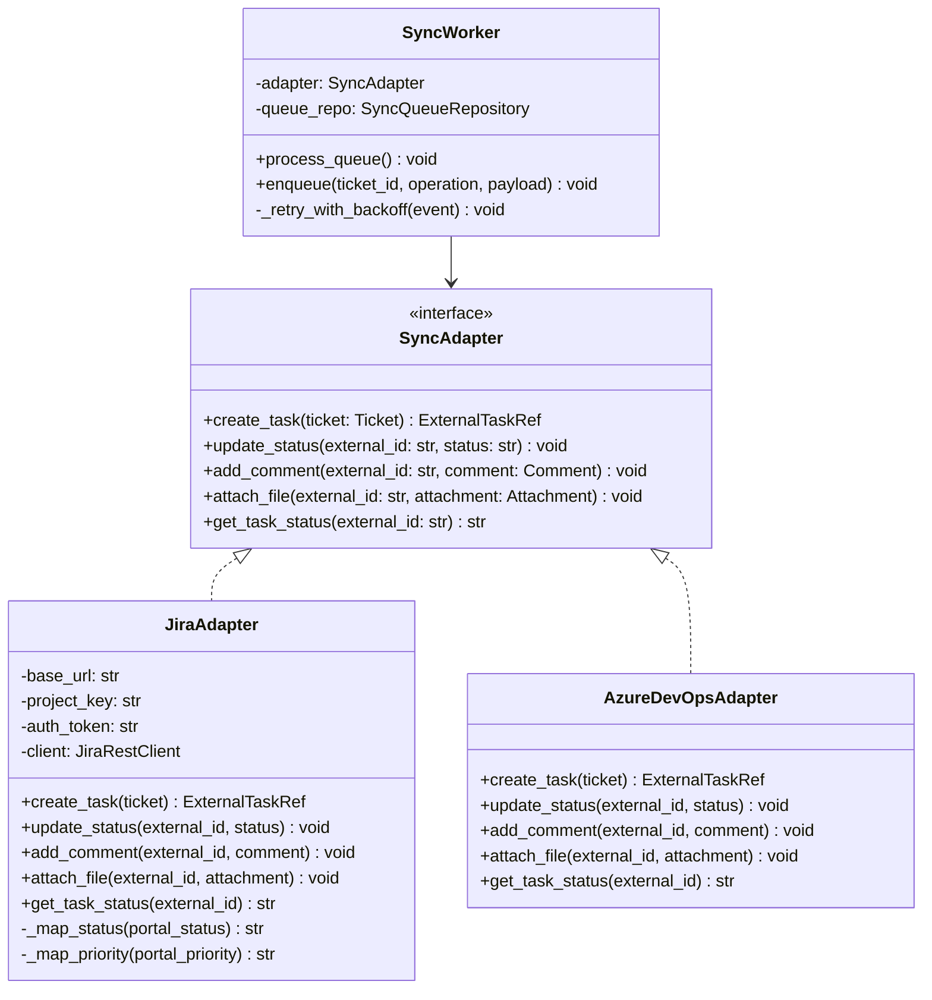

**JIRA-specific mappings:**

| Portal Status | JIRA Status |
|---|---|
| Pending | Pending |
| Approved | Approved |
| In Review | In Review |
| In Progress | In Progress |
| Resolved | Resolved |
| Closed | Closed |
| Rejected | Rejected |
| Removed | Removed |

| Portal Priority | JIRA Priority |
|---|---|
| Low | Low |
| Medium | Medium |
| High | High |
| Critical | Critical |

**JIRA project:** All tickets land in `Business_Backlog`. IT re-categorizes to the correct project bucket manually in JIRA.

**Sync flow:**
1. Ticket event (create / status change / comment / attachment) → `SyncWorker.enqueue(...)` writes a `SYNC_QUEUE` row.
2. Background worker polls every 10 seconds, picks up `pending` rows, calls `adapter.create_task(...)` or appropriate method.
3. On success: marks row `success`, stores `jira_task_id` on ticket.
4. On failure: increments `attempt_count`, schedules retry (10s → 30s → 90s back-off). After 3 failures: marks `failed`, sets `ticket.sync_failed = true`.
5. `GET /sync/health` returns last success timestamp and count of `failed` rows.

---

## Security Design

### Authentication

- **Mechanism**: JWT tokens stored in `httpOnly`, `Secure`, `SameSite=Strict` cookies. No localStorage.
- **Token lifetime**: 8 hours from last activity. Each authenticated request resets the expiry (sliding window).
- **Session invalidation**: Logout endpoint clears the cookie and adds the token JTI to a short-lived blocklist (in-memory dict for PoC, Redis for production).
- **Password hashing**: bcrypt, cost factor 12 minimum.
- **User provisioning**: Portal Admin creates accounts manually. No self-registration.

### Password Reset Flow

```
1. User submits email on /auth/password-reset/request
2. System generates a cryptographically random token (32 bytes, URL-safe base64)
3. Token stored as hash in USER.reset_token, expiry in USER.reset_token_expires (1 hour)
4. Email sent with link: https://<host>/reset-password?token=<raw_token>
5. User submits new password at /auth/password-reset/confirm with token + new password
6. System verifies token hash, checks expiry, updates password_hash, clears reset_token
```

### HTTPS

All traffic over HTTPS. For PoC on Windows, a self-signed certificate is acceptable. Uvicorn is configured with `ssl_keyfile` and `ssl_certfile`.

### Role Enforcement

Every API endpoint uses a FastAPI dependency (`Depends(require_role(...))`) that checks the JWT claims. Role hierarchy:

```
Portal Admin > IT User > Director > Manager > Business User
```

Endpoint-level enforcement is supplemented by service-layer checks (e.g., "only submitter can remove their own ticket").

### RBAC Matrix

| Action | Business User | Manager | Director | IT User | Portal Admin |
|---|---|---|---|---|---|
| Submit ticket | ✓ | ✓ | ✓ | ✓ | ✓ |
| View own tickets | ✓ | ✓ | ✓ | ✓ | ✓ |
| View dept tickets | — | ✓ | ✓ | ✓ | ✓ |
| View all tickets | — | — | — | ✓ | ✓ |
| Add public comment | ✓ | ✓ | ✓ | ✓ | ✓ |
| Add internal comment | — | — | — | ✓ | ✓ |
| View internal comment | — | — | — | ✓ | ✓ |
| Approve/reject ticket | — | ✓ (Manager) | ✓ (Director) | — | — |
| Remove own ticket | ✓ | ✓ | ✓ | — | — |
| Update status | — | — | — | ✓ | ✓ |
| Update category/priority | — | — | — | ✓ | ✓ |
| Soft-delete ticket | — | — | — | — | ✓ |
| Manage users | — | — | — | — | ✓ |
| Manage departments | — | — | — | — | ✓ |
| View audit trail | — | — | — | — | ✓ |
| View sync health | — | — | — | ✓ | ✓ |
| View system health | — | — | — | — | ✓ |

---

## Notification Design

### Events and Recipients

| Event | Email Recipients | In-Portal Recipients |
|---|---|---|
| Ticket submitted | Manager (+ Director if required) | Manager (+ Director if required) |
| Manager approves (Director required) | Director | Director |
| Ticket fully approved | IT team + Submitter | IT team + Submitter |
| Ticket rejected | Submitter | Submitter |
| Status changed | Submitter | Submitter |
| IT adds comment | Submitter | Submitter |
| Submitter adds comment | IT team | IT team |
| Ticket re-opened | IT team | IT team |
| Approval timeout (48h) | Approver (re-notification) | Approver |

### Email Format

Plain text. Example:

```
Subject: [Ticket #TKT-0042] Status changed to In Progress

Hello Jane,

Your ticket "New laptop request" (TKT-0042) has been updated.

New status: In Progress

View your ticket: https://<host>/tickets/42

This is an automated message from the Internal Ticketing Portal.
```

### In-Portal Notification Feed

- `NotificationBell` component polls `GET /notifications` every 30 seconds (or on window focus).
- Unread count shown as badge on bell icon.
- Clicking opens a dropdown list of recent notifications with timestamp and ticket link.
- "Mark all read" button available.

### Notification Service Implementation

```python
class NotificationService:
    def notify(self, event_type: str, ticket: Ticket, recipients: list[User]):
        for user in recipients:
            # Write in-portal notification row
            db.add(Notification(recipient_id=user.id, ticket_id=ticket.id,
                                event_type=event_type, message=...))
            # Send email asynchronously (fire-and-forget for PoC)
            send_email_async(to=user.email, subject=..., body=...)
```

Email sending failures are logged but do not block the main request flow.

---

## Error Handling

| Scenario | Handling |
|---|---|
| JIRA API unavailable | Sync event queued; portal continues normally; `sync_failed` flag set after retries exhausted |
| SMTP unavailable | Email failure logged; in-portal notification still created |
| Invalid status transition | 422 Unprocessable Entity with descriptive message |
| Unauthorized action | 403 Forbidden |
| Ticket not found | 404 Not Found |
| Attachment > 10MB | 413 Request Entity Too Large |
| Approval deadline exceeded | Background job logs audit entry, re-notifies approver |
| Concurrent status update | Optimistic locking via `updated_at` check; 409 Conflict if stale |
| Database error | 500 Internal Server Error; error logged with stack trace |
| Reset token expired | 400 Bad Request with "Token expired" message |

---

## Correctness Properties

*A property is a characteristic or behavior that should hold true across all valid executions of a system — essentially, a formal statement about what the system should do. Properties serve as the bridge between human-readable specifications and machine-verifiable correctness guarantees.*

### Property 1: Ticket submission creates a persisted ticket

*For any* valid ticket submission payload (non-empty title, non-empty description, valid department, valid urgency, valid manager), submitting the form SHALL result in a ticket being retrievable from the database with the same title, description, department, urgency, and a status of "Pending".

**Validates: Requirements FR-1.2, FR-5.3**

### Property 2: Empty/whitespace title or description is rejected

*For any* submission payload where the title or description is empty or composed entirely of whitespace characters, the system SHALL reject the submission and the total ticket count SHALL remain unchanged.

**Validates: Requirements FR-1.4**

### Property 3: Director approval requirement is correctly computed

*For any* ticket submission, the `director_approval_required` flag SHALL be true if and only if `cost > 0` OR `urgency` is "High" or "Critical". For all other combinations, the flag SHALL be false.

**Validates: Requirements (approval flow — Director trigger rules)**

### Property 4: Status transitions respect the lifecycle

*For any* ticket in a given status, only valid next-state transitions SHALL be accepted. Specifically: a ticket in "Closed", "Rejected", or "Removed" status SHALL reject any further status-change request.

**Validates: Requirements FR-3.2**

### Property 5: Audit log is append-only

*For any* sequence of ticket mutations (status changes, field updates, comment additions), the audit log entry count SHALL be monotonically non-decreasing. No mutation operation SHALL reduce the count of audit log entries for a ticket.

**Validates: Requirements AR-1.3**

### Property 6: Internal comments are hidden from non-IT roles

*For any* comment marked `is_internal = true`, the comment SHALL NOT appear in the response of `GET /tickets/{id}/comments` for any user whose role is Business User, Manager, or Director.

**Validates: Requirements (internal comment visibility)**

### Property 7: Soft-delete restricts visibility without data loss

*For any* ticket that has been soft-deleted, the ticket SHALL NOT appear in any list or detail endpoint response for Business User, Manager, Director, or IT User roles. The ticket data SHALL remain in the database and SHALL be accessible to Portal Admin.

**Validates: Requirements (soft-delete behavior)**

### Property 8: Approval sequence is strictly ordered

*For any* ticket where `director_approval_required = true`, the Director approval row SHALL NOT be created (and the Director SHALL NOT be notified) until the Manager has recorded an "approved" decision. The Manager approval SHALL always precede the Director approval.

**Validates: Requirements (sequential approval flow)**

### Property 9: Comment round-trip preserves content and authorship

*For any* comment submitted to a ticket, retrieving the ticket's comment list SHALL return a comment with the identical body text, the correct author identity, and a non-null timestamp.

**Validates: Requirements FR-2.4**

### Property 10: Ticket list is role-scoped

*For any* authenticated user, the ticket list returned by `GET /tickets` SHALL contain only tickets the user is authorized to see: Business Users see only their own tickets; Managers and Directors see only tickets from their department; IT Users and Admins see all tickets.

**Validates: Requirements FR-2.1, FR-3.1, FR-4.4, FR-4.5**

---

## Testing Strategy

### Unit Tests

Focus on specific examples, edge cases, and pure logic:
- Ticket validation logic (empty fields, field length limits)
- `director_approval_required` computation for all urgency/cost combinations
- Status transition guard — valid and invalid transitions
- Password hashing and verification
- JWT token generation and expiry
- JIRA status/priority mapping functions
- Notification message formatting
- Audit log entry construction

### Property-Based Tests

Use [Hypothesis](https://hypothesis.readthedocs.io/) (Python PBT library). Each property test runs a minimum of 100 iterations.

Each test is tagged with a comment referencing the design property:
```python
# Feature: internal-ticketing-system, Property 1: Ticket submission creates a persisted ticket
```

Properties to implement as Hypothesis tests:
- **Property 1**: Generate random valid ticket payloads → verify persisted ticket matches input and status is "Pending"
- **Property 2**: Generate strings of whitespace/empty → verify submission is rejected and ticket count unchanged
- **Property 3**: Generate all combinations of urgency × cost (0 / >0) → verify `director_approval_required` flag
- **Property 4**: Generate random status values → verify only valid transitions are accepted from each state
- **Property 5**: Generate sequences of ticket mutations → verify audit log count never decreases
- **Property 6**: Generate random comments with `is_internal=True` → verify non-IT roles cannot see them
- **Property 7**: Soft-delete a random ticket → verify it disappears from non-Admin list endpoints
- **Property 8**: Generate tickets with `director_approval_required=True` → verify Director row absent until Manager approves
- **Property 9**: Generate random comment bodies and authors → verify round-trip preserves content and authorship
- **Property 10**: Generate random users of each role → verify ticket list contains only authorized tickets

### Integration Tests

Example-based tests against a real SQLite test database:
- End-to-end ticket submission → JIRA sync (using a mock JIRA adapter)
- Full approval flow: Manager approve → Director approve → IT status updates
- Password reset flow: request → email token → confirm new password
- Notification delivery: verify `Notification` rows created for each event type
- Sync retry logic: simulate JIRA API failure → verify retry count increments → verify `sync_failed` flag after exhaustion

### Smoke Tests

Single-execution checks:
- Application starts and `/sync/health` returns 200
- Database migrations run without error on a fresh SQLite file
- JIRA adapter can authenticate with configured credentials


---

## End-to-End Workflow

This section documents the six primary workflows of the Internal Ticketing System. Each workflow covers the happy path (ideal flow), exception paths (failure modes and system responses), and manual override points (where a human can intervene to change the flow).

---

### Workflow 1: Business Request Submission

#### Happy Path

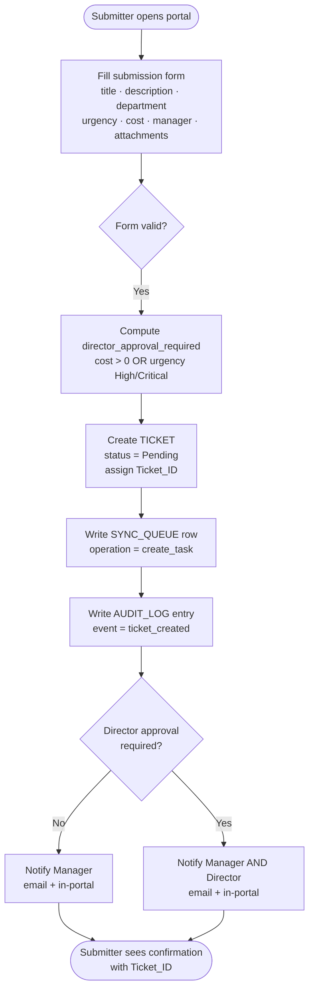

#### Exception Paths

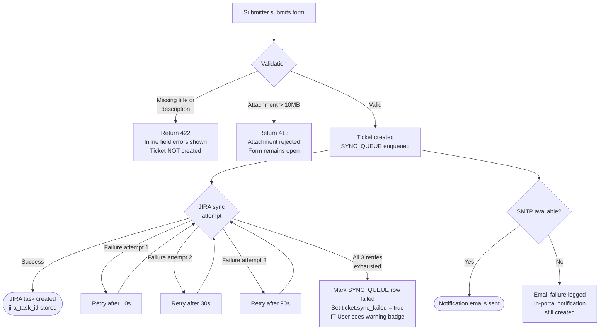

#### Manual Override Points

| Actor | Override | Condition | Result |
|---|---|---|---|
| Submitter | Withdraw ticket (→ Removed) | Any time before IT starts work (status ≠ In Progress / Resolved / Closed) | Status set to Removed (terminal); SYNC_QUEUE row enqueued to update JIRA |

---

### Workflow 2: IT Triage

#### Happy Path

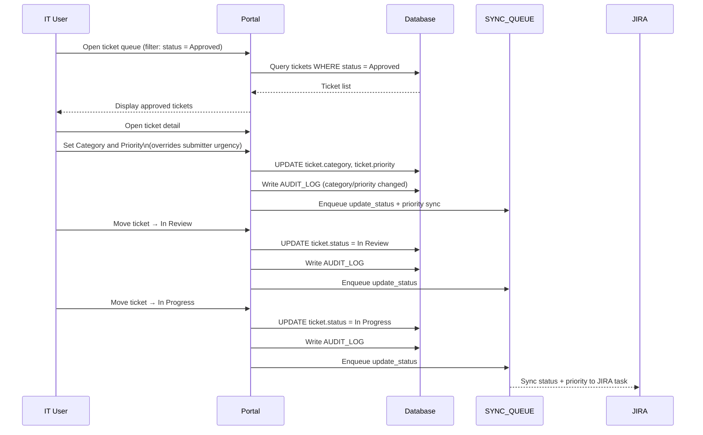

#### Exception Paths

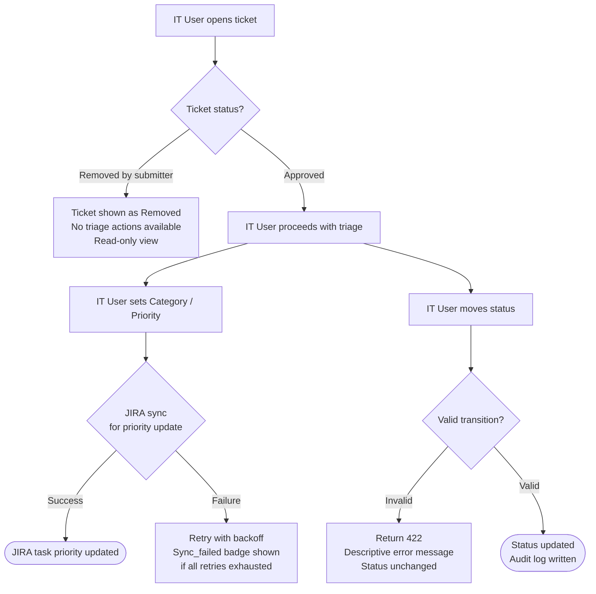

#### Manual Override Points

| Actor | Override | Condition | Result |
|---|---|---|---|
| IT User | Override Priority at any time | Ticket not in terminal state | Priority updated; SYNC_QUEUE row enqueued to sync new priority to JIRA |
| IT User | Send ticket back to In Review from In Progress | Ticket status = In Progress | Status reverts to In Review; audit log entry written |
| Portal Admin | Soft-delete ticket | Ticket status = Closed or Rejected | `is_deleted = true`; ticket hidden from all non-Admin views; data retained |

---

### Workflow 3: JIRA Issue Creation

#### Happy Path

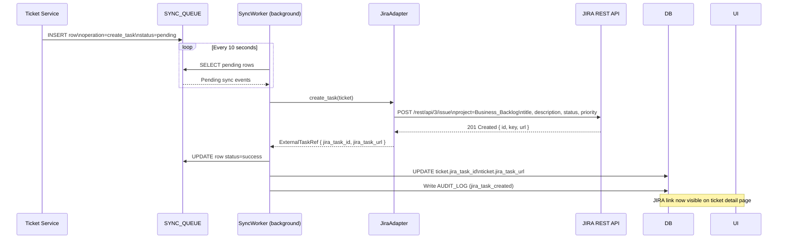

#### Exception Paths

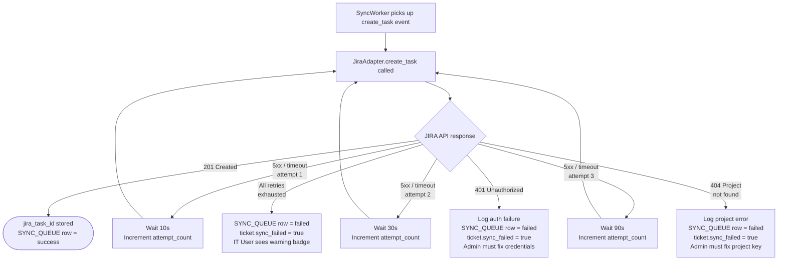

#### Manual Override Points

| Actor | Override | Condition | Result |
|---|---|---|---|
| Portal Admin | View sync health dashboard (`GET /sync/health`) | Any time | Shows last success timestamp, count of failed rows, pending retries |
| IT User | See `sync_failed` indicator on ticket detail | ticket.sync_failed = true | Visual warning badge displayed; no manual re-trigger in PoC (future enhancement) |

> **Note:** Manual re-triggering of a failed sync is a planned future enhancement. In the PoC, the Portal Admin must resolve the underlying JIRA connectivity or configuration issue; the SyncWorker will not automatically retry `failed` rows after exhaustion.

---

### Workflow 4: Request Status Synchronization

#### Happy Path

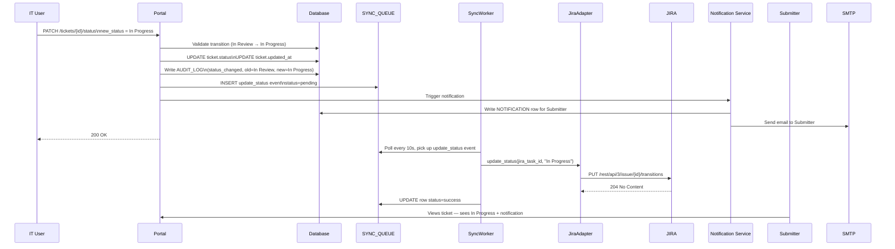

#### Exception Paths

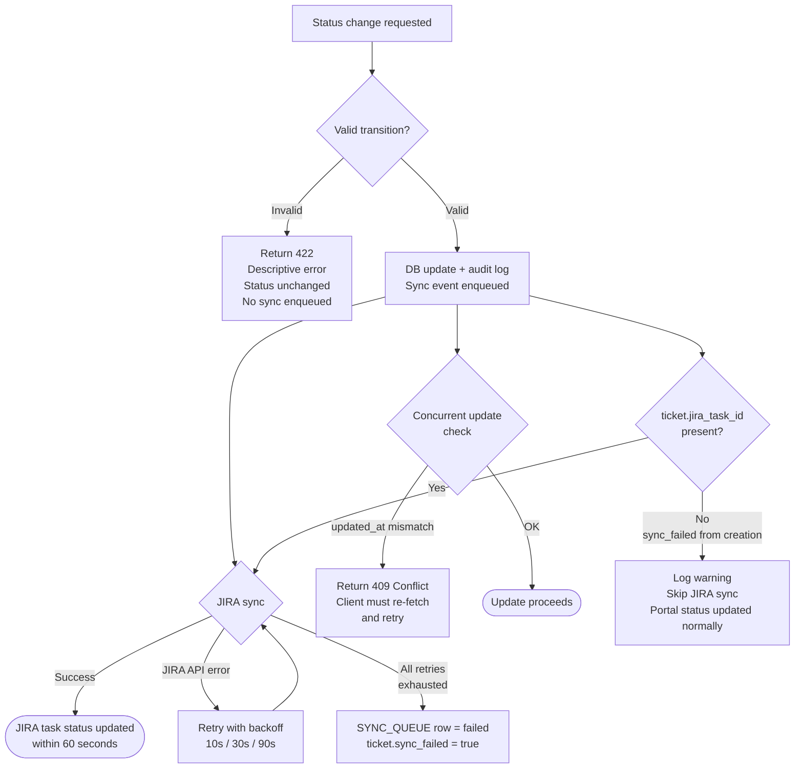

#### Manual Override Points

| Actor | Override | Condition | Result |
|---|---|---|---|
| IT User | Override Priority (separate sync event) | Any non-terminal status | Priority updated in portal and JIRA independently of status sync |
| Portal Admin | Monitor sync health dashboard | Any time | View pending/failed sync events; identify stale tickets |

---

### Workflow 5: Comment Synchronization

#### Happy Path

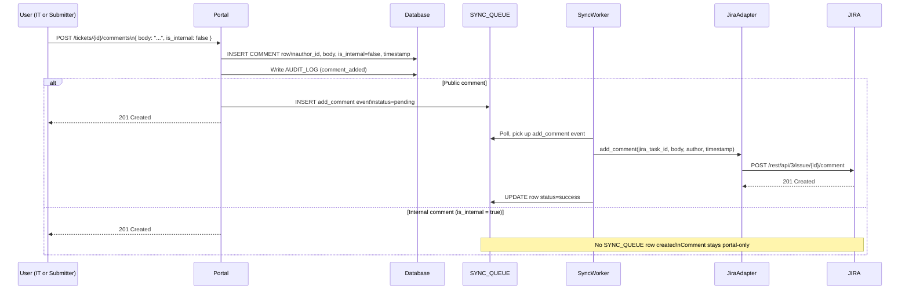

#### Exception Paths

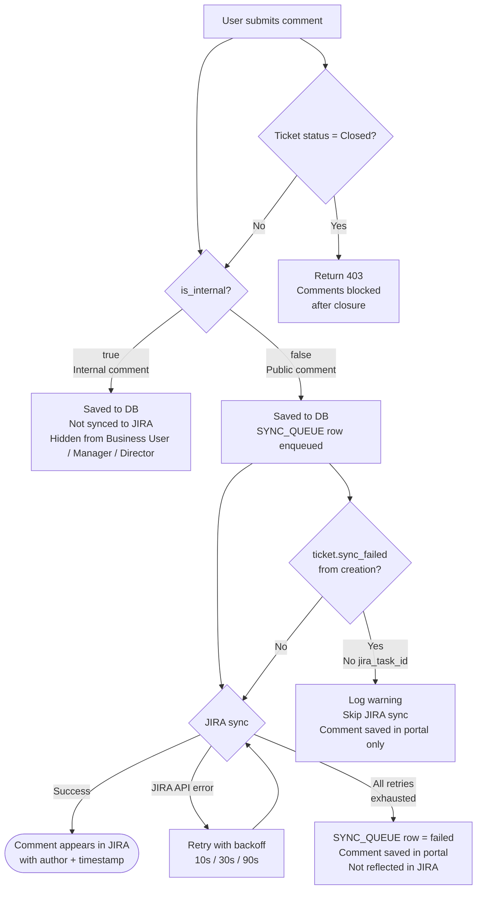

#### Manual Override Points

| Actor | Override | Condition | Result |
|---|---|---|---|
| IT User | Choose public vs internal at comment creation | Any non-Closed ticket | `is_internal` flag set at write time; cannot be changed after creation |

---

### Workflow 6: Closure and Business Confirmation

#### Happy Path

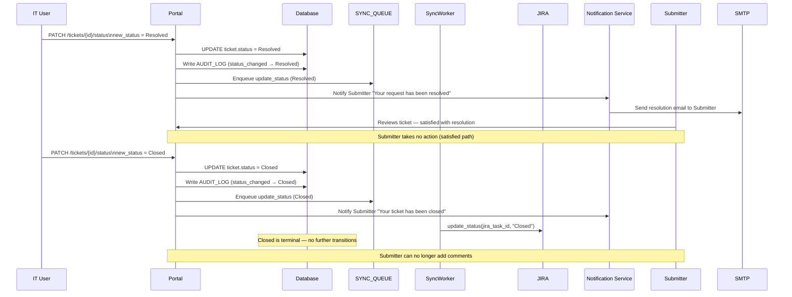

#### Re-open Path (Submitter Not Satisfied)

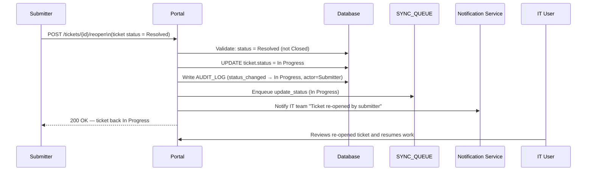

#### Exception Paths

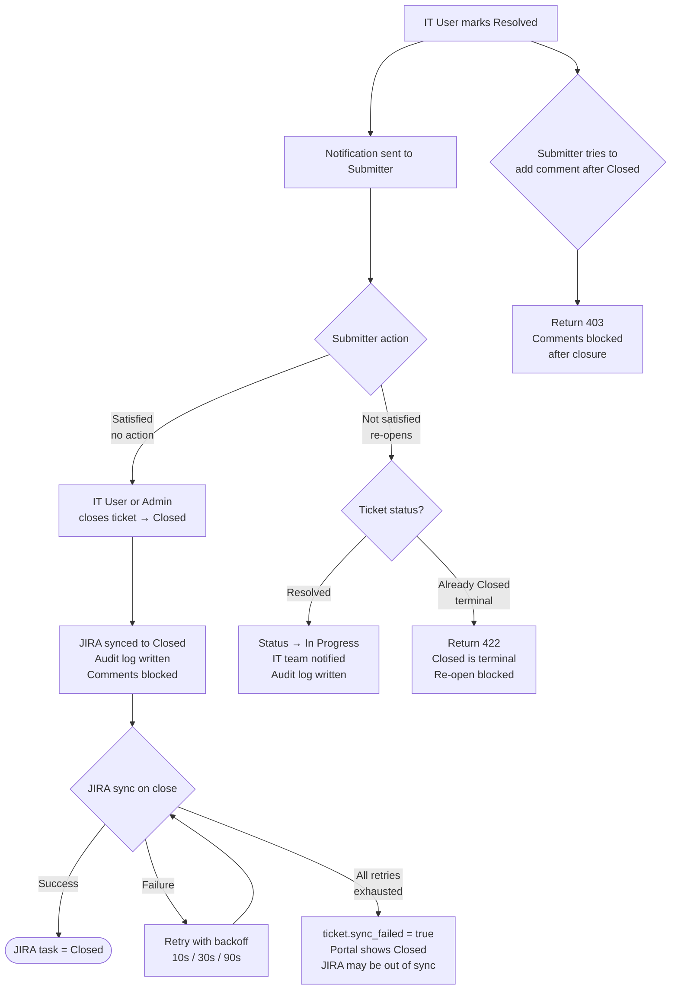

#### Manual Override Points

| Actor | Override | Condition | Result |
|---|---|---|---|
| IT User | Re-open ticket from Resolved | Ticket status = Resolved (before Closed) | Status → In Progress; IT team notified; audit log written |
| Submitter | Re-open ticket from Resolved | Ticket status = Resolved (before Closed) | Status → In Progress; IT team notified; audit log written |
| Portal Admin | Soft-delete Closed ticket | Ticket status = Closed AND age ≥ 30 days (retention policy) | `is_deleted = true`; ticket hidden from all non-Admin views; data retained in DB |

> **Closed is terminal.** Once a ticket reaches Closed status, no status transitions are permitted. Any re-open attempt against a Closed ticket returns 422. The only Admin action available is soft-delete after the 30-day retention window.

---

## User Roles and Permission Model

This section defines the complete role model for the PoC. The table below maps the user-facing role names to their internal system identifiers and clarifies how they align with the roles referenced throughout the rest of this document.

### Role Name Mapping

| User-Facing Role Name | Internal Role Identifier | Maps To (Prior Design) |
|---|---|---|
| Business Requester | `business_user` | Business User |
| IT Triage Analyst | `it_triage` | IT User (triage-focused subset) |
| IT Manager | `it_manager` | Director (approval authority) |
| Platform Admin | `platform_admin` | Portal Admin |
| Auditor | `auditor` | New role — read-only audit access |

> The `it_triage` and `it_manager` roles replace the single `IT User` role from earlier sections. The `auditor` role is new and has no write access anywhere in the system. All API enforcement references these internal identifiers.

---

### Role Hierarchy

```
Platform Admin
    └── IT Manager (Director)
        └── IT Triage Analyst
            └── Business Requester
Auditor (orthogonal — read-only, no hierarchy position)
```

---

### Role 1: Business Requester (`business_user`)

**Description:** An internal employee who submits service or business requests, tracks their own tickets, and communicates with IT via public comments.

#### Allowed Actions

| Action | Condition |
|---|---|
| Submit a new ticket | Always |
| View own tickets (list + detail) | Always |
| Add a public comment to own ticket | Ticket status ≠ Closed |
| Upload an attachment to own ticket | Ticket status ≠ Closed or Removed |
| Download attachments on own ticket | Always |
| Mark own ticket as Removed (withdraw) | Status is Pending or In Review |
| Re-open own ticket | Status is Resolved (not Closed) |
| View own ticket history (public entries) | Always |
| Receive in-portal and email notifications | Always |
| Request password reset | Always |

#### Prohibited Actions

| Prohibited Action | Enforcement |
|---|---|
| View tickets submitted by other users | 403 on `GET /tickets/{id}` if not owner |
| Add internal (IT-only) comments | 403 on `POST /tickets/{id}/comments` with `is_internal=true` |
| View internal comments | Filtered out of `GET /tickets/{id}/comments` response |
| Update ticket status, category, or priority | 403 |
| Approve or reject any ticket | 403 |
| Access approval queue | 403 |
| View audit trail | 403 |
| View sync health or system health | 403 |
| Manage users or departments | 403 |
| Delete any ticket | 403 |
| Add comments to Closed tickets | 403 |

#### Data Visibility

| Data | Visible? | Scope |
|---|---|---|
| Ticket list | ✓ | Own tickets only |
| Ticket detail | ✓ | Own tickets only |
| Public comments | ✓ | Own tickets only |
| Internal comments | ✗ | Never |
| Ticket history (public events) | ✓ | Own tickets only |
| Approval decisions (outcome only) | ✓ | Own tickets — sees Approved/Rejected, not approver notes |
| JIRA task link | ✓ | Own tickets (read-only reference link) |
| Other users' data | ✗ | Never |
| Audit log | ✗ | Never |
| Sync health | ✗ | Never |
| Dashboard | ✓ | Own ticket counts by status only |

#### Approval Authority

None. Business Requesters have no approval authority. They select their Manager at submission time but cannot approve or reject any ticket.

---

### Role 2: IT Triage Analyst (`it_triage`)

**Description:** An IT team member responsible for reviewing approved tickets, assigning category and priority, progressing tickets through the IT workflow, and communicating with requesters.

#### Allowed Actions

| Action | Condition |
|---|---|
| View all tickets across all departments | Always |
| Filter ticket list by status, category, priority, department, submitter | Always |
| View full ticket detail including internal comments | Always |
| Set or update Category on any ticket | Ticket not in terminal state |
| Set or update IT-assigned Priority on any ticket | Ticket not in terminal state (syncs to JIRA) |
| Move ticket: Approved → In Review | Always |
| Move ticket: In Review → In Progress | Always |
| Move ticket: In Progress → In Review (send back) | Always |
| Move ticket: In Progress → Resolved | Always |
| Move ticket: Resolved → Closed | Always |
| Re-open ticket: Resolved → In Progress | Always |
| Add public comment to any ticket | Ticket status ≠ Closed |
| Add internal-only comment to any ticket | Ticket status ≠ Closed |
| Upload attachment to any ticket | Ticket not in terminal state |
| Download any attachment | Always |
| View JIRA sync status and sync_failed indicator | Always |
| View sync health dashboard (`GET /sync/health`) | Always |
| Receive in-portal and email notifications | Always |

#### Prohibited Actions

| Prohibited Action | Enforcement |
|---|---|
| Approve or reject tickets (approval queue) | 403 — approval is Manager/Director only |
| Soft-delete tickets | 403 — Platform Admin only |
| Manage users or departments | 403 |
| View full audit log | 403 — Platform Admin and Auditor only |
| Access system health admin panel | 403 |
| Move ticket to terminal state Rejected or Removed | 403 — Rejected is approval-only; Removed is submitter-only |
| Modify or delete audit log entries | Enforced at DB layer — append-only |

#### Data Visibility

| Data | Visible? | Scope |
|---|---|---|
| Ticket list | ✓ | All tickets, all departments |
| Ticket detail | ✓ | All tickets |
| Public comments | ✓ | All tickets |
| Internal comments | ✓ | All tickets |
| Ticket history | ✓ | All tickets (all events including internal field changes) |
| Approval decisions (outcome + approver name) | ✓ | All tickets |
| JIRA task link and sync status | ✓ | All tickets |
| Other users' profile data | ✗ | Cannot access user management |
| Audit log | ✗ | Cannot access full audit log UI |
| Sync health endpoint | ✓ | Read-only |
| Dashboard | ✓ | All tickets across all departments |

#### Approval Authority

None. IT Triage Analysts cannot approve or reject tickets. They only act on tickets that have already been approved through the Manager/Director chain.

---

### Role 3: IT Manager (`it_manager`)

**Description:** A business-side manager or director who approves or rejects incoming requests from their team before they reach IT. Also has full visibility into their department's tickets.

> This role maps to both the **Manager** and **Director** approval steps in the sequential approval flow. In the system, a user assigned `it_manager` can act as either a first-tier approver (Manager step) or a second-tier approver (Director step) depending on how they are selected during ticket submission and how the `director_approval_required` flag is computed.

#### Allowed Actions

| Action | Condition |
|---|---|
| View all tickets from their department | Always |
| View ticket detail for department tickets | Always |
| Approve a ticket pending their approval decision | Ticket has an open APPROVAL row assigned to this user |
| Reject a ticket pending their approval decision | Ticket has an open APPROVAL row assigned to this user; must provide rejection reason |
| Add a public comment to any department ticket | Ticket status ≠ Closed |
| Submit their own tickets | Always |
| Withdraw (Remove) their own submitted tickets | Status is Pending or In Review |
| Re-open their own Resolved tickets | Status is Resolved |
| Receive in-portal and email notifications | Always |
| View approval queue (`GET /approvals/pending`) | Always |

#### Prohibited Actions

| Prohibited Action | Enforcement |
|---|---|
| Approve or reject tickets not assigned to them | 403 — service-layer check on approver_id |
| View tickets outside their department (unless they submitted them) | Filtered at query layer |
| Add internal-only comments | 403 |
| View internal comments | Filtered out of response |
| Update ticket status, category, or priority | 403 — IT Triage Analyst action only |
| Soft-delete tickets | 403 |
| Manage users or departments | 403 |
| View audit log | 403 |
| View sync health | 403 |

#### Data Visibility

| Data | Visible? | Scope |
|---|---|---|
| Ticket list | ✓ | Department tickets + own submitted tickets |
| Ticket detail | ✓ | Department tickets + own submitted tickets |
| Public comments | ✓ | Department tickets |
| Internal comments | ✗ | Never |
| Ticket history | ✓ | Department tickets — public events only (status changes, approvals) |
| Approval queue | ✓ | Only approvals assigned to this user |
| Approval decisions by others | ✓ | Outcome visible on ticket detail (Approved/Rejected) |
| JIRA task link | ✓ | Read-only reference |
| Audit log | ✗ | Never |
| Sync health | ✗ | Never |
| Dashboard | ✓ | Department ticket counts by status |

#### Approval Authority

| Approval Step | Authority |
|---|---|
| Manager approval (first tier) | ✓ Can approve or reject — triggers Director step if `director_approval_required = true` |
| Director approval (second tier) | ✓ Can approve or reject — only notified after Manager approves |
| Approve tickets not assigned to them | ✗ Prohibited |
| Override another approver's decision | ✗ Prohibited — decisions are immutable once recorded |

**Rejection rule:** If an IT Manager rejects at the Manager step, the ticket is immediately set to Rejected and the Director is never notified. If they reject at the Director step, the ticket is immediately set to Rejected and IT is never notified.

---

### Role 4: Platform Admin (`platform_admin`)

**Description:** The system administrator responsible for configuring and maintaining the portal. Has full access to all data, configuration, and administrative functions.

#### Allowed Actions

| Action | Condition |
|---|---|
| All actions available to IT Triage Analyst | Always |
| Create user accounts | Always |
| Update user accounts (role, active status, department) | Always |
| Deactivate user accounts | Always |
| Manage department list (create, update, deactivate) | Always |
| Soft-delete tickets | Ticket status = Closed or Rejected only |
| View full audit trail UI (`GET /audit/log`) | Always |
| View per-ticket audit history (`GET /audit/tickets/{id}`) | Always |
| View system health dashboard | Always |
| View sync health dashboard | Always |
| View all notifications (system-wide) | Always |
| Reset any user's password (admin-initiated) | Always |
| View soft-deleted tickets | Always (Admin-only view) |

#### Prohibited Actions

| Prohibited Action | Enforcement |
|---|---|
| Hard-delete any ticket or data | No hard-delete endpoint exists |
| Soft-delete tickets in non-terminal states (Pending, Approved, In Review, In Progress, Resolved) | 422 — only Closed or Rejected tickets may be soft-deleted |
| Modify or delete audit log entries | Enforced at DB layer — append-only |
| Approve or reject tickets on behalf of a Manager/Director | 403 — approval actions are role-specific to `it_manager` |
| Permanently purge soft-deleted data before 30-day retention window | Enforced by retention policy check in soft-delete service |

#### Data Visibility

| Data | Visible? | Scope |
|---|---|---|
| Ticket list | ✓ | All tickets including soft-deleted |
| Ticket detail | ✓ | All tickets |
| Public and internal comments | ✓ | All tickets |
| Full ticket history | ✓ | All tickets, all events |
| Approval decisions | ✓ | All tickets, full detail |
| JIRA task link and sync status | ✓ | All tickets |
| Audit log | ✓ | Full system-wide audit log, filterable |
| Sync health | ✓ | Full sync health including failed event details |
| System health | ✓ | Application status, DB stats, background worker status |
| User accounts | ✓ | All users |
| Department list | ✓ | All departments including inactive |
| Dashboard | ✓ | All tickets + system health metrics |

#### Approval Authority

None in the ticket approval chain. Platform Admins configure the system but do not participate in the Manager → Director approval workflow. They cannot approve or reject tickets on behalf of other roles.

---

### Role 5: Auditor (`auditor`)

**Description:** A read-only role for compliance, governance, or internal audit personnel who need visibility into ticket history, approval decisions, and system activity without the ability to modify anything.

> This is a new role not present in earlier sections of this document. It is strictly read-only. No write, update, or delete operation is permitted for this role under any circumstance.

#### Allowed Actions

| Action | Condition |
|---|---|
| View all tickets (list + detail) | Always |
| View all public comments | Always |
| View all internal comments | Always |
| View full ticket history for any ticket | Always |
| View approval decisions (approver, decision, timestamp, reason) | Always |
| View full audit log (`GET /audit/log`) | Always |
| View per-ticket audit history | Always |
| View JIRA task link and sync status | Always |
| View sync health dashboard | Always |
| Export audit log (future production feature) | When implemented |
| Receive in-portal notifications | Always |

#### Prohibited Actions

| Prohibited Action | Enforcement |
|---|---|
| Submit tickets | 403 |
| Add any comment (public or internal) | 403 |
| Upload or delete attachments | 403 |
| Update ticket status, category, or priority | 403 |
| Approve or reject tickets | 403 |
| Soft-delete or hard-delete tickets | 403 |
| Manage users or departments | 403 |
| Trigger any write operation of any kind | 403 on all mutating endpoints |

#### Data Visibility

| Data | Visible? | Scope |
|---|---|---|
| Ticket list | ✓ | All tickets, all departments |
| Ticket detail | ✓ | All tickets |
| Public comments | ✓ | All tickets |
| Internal comments | ✓ | All tickets |
| Full ticket history | ✓ | All tickets, all events |
| Approval decisions | ✓ | Full detail — approver identity, decision, timestamp, reason |
| JIRA task link and sync status | ✓ | All tickets |
| Audit log | ✓ | Full system-wide audit log |
| Sync health | ✓ | Read-only |
| System health | ✗ | Platform Admin only |
| User account management | ✗ | Platform Admin only |
| Department management | ✗ | Platform Admin only |

#### Approval Authority

None. Auditors are strictly observers. They have no authority to approve, reject, or influence any ticket at any stage.

---

### Consolidated RBAC Matrix (Updated)

The following matrix supersedes the RBAC Matrix in the Security Design section above.

| Action | Business Requester | IT Manager | IT Triage Analyst | Platform Admin | Auditor |
|---|---|---|---|---|---|
| Submit ticket | ✓ | ✓ | ✓ | ✓ | ✗ |
| View own tickets | ✓ | ✓ | ✓ | ✓ | — |
| View dept tickets | ✗ | ✓ | ✓ | ✓ | ✓ |
| View all tickets | ✗ | ✗ | ✓ | ✓ | ✓ |
| Add public comment | ✓ (own) | ✓ (dept) | ✓ (all) | ✓ (all) | ✗ |
| Add internal comment | ✗ | ✗ | ✓ | ✓ | ✗ |
| View internal comments | ✗ | ✗ | ✓ | ✓ | ✓ |
| Approve ticket (Manager step) | ✗ | ✓ | ✗ | ✗ | ✗ |
| Approve ticket (Director step) | ✗ | ✓ | ✗ | ✗ | ✗ |
| Reject ticket | ✗ | ✓ | ✗ | ✗ | ✗ |
| Remove own ticket | ✓ | ✓ | ✗ | ✗ | ✗ |
| Update status | ✗ | ✗ | ✓ | ✓ | ✗ |
| Update category / priority | ✗ | ✗ | ✓ | ✓ | ✗ |
| Re-open ticket | ✓ (own) | ✓ (own) | ✓ (all) | ✓ (all) | ✗ |
| Upload attachment | ✓ (own) | ✓ (own) | ✓ (all) | ✓ (all) | ✗ |
| Download attachment | ✓ (own) | ✓ (dept) | ✓ (all) | ✓ (all) | ✓ (all) |
| Soft-delete ticket | ✗ | ✗ | ✗ | ✓ (Closed/Rejected only) | ✗ |
| Manage users | ✗ | ✗ | ✗ | ✓ | ✗ |
| Manage departments | ✗ | ✗ | ✗ | ✓ | ✗ |
| View audit trail UI | ✗ | ✗ | ✗ | ✓ | ✓ |
| View sync health | ✗ | ✗ | ✓ | ✓ | ✓ |
| View system health | ✗ | ✗ | ✗ | ✓ | ✗ |
| View approval queue | ✗ | ✓ (own) | ✗ | ✗ | ✓ (read) |
| View full ticket history | ✓ (own, public) | ✓ (dept, public) | ✓ (all) | ✓ (all) | ✓ (all) |

---

### API Role Enforcement Reference

The following table maps each API endpoint to the roles permitted to call it. Enforcement is implemented via FastAPI `Depends(require_role(...))` at the router level, supplemented by service-layer ownership checks.

| Endpoint | Method | Permitted Roles | Notes |
|---|---|---|---|
| `/auth/login` | POST | Public | — |
| `/auth/logout` | POST | All authenticated | — |
| `/auth/password-reset/request` | POST | Public | — |
| `/auth/password-reset/confirm` | POST | Public | — |
| `/tickets` | GET | All authenticated | Response filtered by role |
| `/tickets` | POST | `business_user`, `it_manager`, `it_triage`, `platform_admin` | Auditor cannot submit |
| `/tickets/{id}` | GET | All authenticated | 403 if not authorized for this ticket |
| `/tickets/{id}/status` | PATCH | `it_triage`, `platform_admin` | — |
| `/tickets/{id}/category-priority` | PATCH | `it_triage`, `platform_admin` | — |
| `/tickets/{id}` | DELETE | `platform_admin` | Soft-delete; Closed/Rejected only |
| `/tickets/{id}/remove` | POST | Submitter only (any role) | Service-layer: submitter_id check |
| `/tickets/{id}/reopen` | POST | `it_triage`, `platform_admin`, submitter (own) | Service-layer: ownership or IT role |
| `/tickets/{id}/comments` | GET | All authenticated | Internal comments filtered by role |
| `/tickets/{id}/comments` | POST | All except `auditor` | `is_internal` only for `it_triage`, `platform_admin` |
| `/tickets/{id}/attachments` | POST | All except `auditor` | — |
| `/tickets/{id}/attachments/{aid}` | GET | All authenticated | 403 if not authorized for this ticket |
| `/approvals/pending` | GET | `it_manager`, `platform_admin`, `auditor` | Auditor: read-only |
| `/approvals/{id}/approve` | POST | `it_manager` | Service-layer: approver_id check |
| `/approvals/{id}/reject` | POST | `it_manager` | Service-layer: approver_id check |
| `/users` | GET | `platform_admin` | — |
| `/users` | POST | `platform_admin` | — |
| `/users/{id}` | PATCH | `platform_admin` | — |
| `/users/managers` | GET | `business_user`, `it_manager`, `platform_admin` | For submission dropdown |
| `/departments` | GET | All authenticated | — |
| `/departments` | POST | `platform_admin` | — |
| `/departments/{id}` | PATCH | `platform_admin` | — |
| `/notifications` | GET | All authenticated | — |
| `/notifications/{id}/read` | POST | All authenticated | — |
| `/notifications/read-all` | POST | All authenticated | — |
| `/audit/tickets/{id}` | GET | `platform_admin`, `auditor` | — |
| `/audit/log` | GET | `platform_admin`, `auditor` | — |
| `/sync/health` | GET | `it_triage`, `platform_admin`, `auditor` | — |

---

## JIRA Cloud Integration Design

This section provides the detailed integration specification for the JIRA Cloud adapter. It covers field mapping, Atlassian Document Format (ADF) handling, authentication, create metadata discovery, retry logic, idempotency, duplicate prevention, failure handling, and the Azure DevOps compatibility contract.

---

### Authentication

JIRA Cloud uses HTTP Basic Auth with an API token — not a password. The token is scoped to a single Atlassian account.

```
Authorization: Basic base64(<email>:<api_token>)
Content-Type: application/json
```

**Configuration (environment variables, never hardcoded):**

```
JIRA_BASE_URL=https://<your-org>.atlassian.net
JIRA_USER_EMAIL=service-account@example.com
JIRA_API_TOKEN=<token from id.atlassian.com>
JIRA_PROJECT_KEY=BB
JIRA_ISSUE_TYPE=Task
```

**Required JIRA Cloud permissions for the service account:**
- `Browse projects` — required to read project metadata and issue details
- `Create issues` — required to create new issues
- `Edit issues` — required to update status, priority, and fields
- `Add comments` — required to post comments
- `Create attachments` — required to upload files

---

### Create Metadata Discovery

JIRA Cloud's `POST /rest/api/3/issue` only accepts fields that are present in the project's create metadata. Submitting an unknown or unsupported field returns a 400 error. The adapter must discover valid fields before constructing payloads.

**Endpoint:**
```
GET /rest/api/3/issue/createmeta?projectKeys=BB&issuetypeNames=Task&expand=projects.issuetypes.fields
```

**When to call it:**
- Once at adapter startup (cached in memory for the PoC lifetime)
- Re-fetched on a 400 response that indicates a field schema mismatch

**What to extract:**
- Allowed field keys for the `BB` / `Task` combination
- Whether `description` uses ADF (it always does on JIRA Cloud)
- Whether `priority` is a supported field on this project
- Whether `labels` is a supported field
- Whether `reporter` can be set (requires `Modify reporter` permission)

**Caching strategy (PoC):**
```python
class JiraAdapter:
    _create_meta_cache: dict = {}  # field_key -> field_schema
    _cache_fetched_at: datetime = None
    _CACHE_TTL_SECONDS = 3600  # 1 hour

    def _get_create_meta(self) -> dict:
        if not self._cache_fetched_at or \
           (datetime.utcnow() - self._cache_fetched_at).seconds > self._CACHE_TTL_SECONDS:
            self._create_meta_cache = self._fetch_create_meta()
            self._cache_fetched_at = datetime.utcnow()
        return self._create_meta_cache
```

---

### Atlassian Document Format (ADF)

JIRA Cloud requires multi-line text fields (specifically `description`) to be submitted as ADF — a structured JSON document format — not plain text strings. Submitting a plain string to the `description` field returns a 400 error.

**ADF structure for a plain-text description:**

```json
{
  "version": 1,
  "type": "doc",
  "content": [
    {
      "type": "paragraph",
      "content": [
        {
          "type": "text",
          "text": "The user's description text goes here."
        }
      ]
    }
  ]
}
```

**ADF builder utility:**

```python
def to_adf(text: str) -> dict:
    """
    Converts a plain text string to minimal valid ADF.
    Preserves newlines as separate paragraphs.
    """
    paragraphs = [p.strip() for p in text.split("\n") if p.strip()]
    if not paragraphs:
        paragraphs = [""]
    return {
        "version": 1,
        "type": "doc",
        "content": [
            {
                "type": "paragraph",
                "content": [{"type": "text", "text": para}]
            }
            for para in paragraphs
        ]
    }
```

**Fields that require ADF on JIRA Cloud:**
- `description` — always ADF
- `comment.body` — always ADF (when using `POST /rest/api/3/issue/{id}/comment`)

**Fields that do NOT use ADF:**
- `summary` — plain string (max 255 chars)
- `labels` — array of strings
- `priority.name` — plain string

---

### Field Mapping: Portal Ticket → JIRA Issue

The following table defines how each portal ticket field maps to a JIRA Cloud issue field.

| Portal Field | JIRA Field | Type | Notes |
|---|---|---|---|
| `ticket.ticket_id` + `ticket.title` | `summary` | String | Format: `[TKT-{id}] {title}` — max 255 chars; truncate title if needed |
| `ticket.description` | `description` | ADF document | Converted via `to_adf()` |
| `ticket.department` | `labels` | Array of strings | Format: `dept:{department_name}` e.g. `["dept:Finance"]` |
| `ticket.urgency` | `labels` | Array of strings | Format: `urgency:{urgency}` e.g. `["urgency:High"]` — separate from IT priority |
| `ticket.priority` (IT-assigned) | `priority.name` | String | Mapped via priority table below; only set after IT assigns |
| `ticket.status` | Transition (not a field) | Workflow transition | Status is set via `POST /rest/api/3/issue/{id}/transitions`, not as a field |
| `ticket.submitter.display_name` | `reporter` | AccountId | Requires `Modify reporter` permission; falls back to service account if not permitted |
| `ticket.category` | `labels` | Array of strings | Format: `category:{category}` e.g. `["category:Hardware"]` |
| `ticket.cost` | `labels` | Array of strings | Format: `cost:yes` if cost > 0, omitted otherwise |
| `ticket.director_approval_required` | `labels` | Array of strings | `director-approval:required` if true |
| Portal Ticket_ID | `labels` | Array of strings | Format: `portal-id:{ticket_id}` — used for idempotency lookup |
| JIRA project | `project.key` | String | Always `BB` (Business_Backlog) |
| JIRA issue type | `issuetype.name` | String | Always `Task` (configurable via `JIRA_ISSUE_TYPE`) |

**Label strategy rationale:** JIRA Cloud custom fields require project-specific configuration. Using labels avoids dependency on custom field setup, making the PoC deployable against any JIRA Cloud project without schema changes.

---

### Priority Mapping

| Portal Priority (IT-assigned) | JIRA Priority Name |
|---|---|
| Low | Low |
| Medium | Medium |
| High | High |
| Critical | Highest |

> JIRA Cloud uses "Highest" not "Critical". The adapter maps `Critical → Highest` on write. On any future read-back, `Highest` maps back to `Critical`.

**Submitter urgency is NOT mapped to JIRA priority.** It is stored as a label (`urgency:High`) so IT can see it in JIRA without it affecting JIRA's priority field, which is reserved for IT-assigned priority.

---

### Status Mapping and Transition Handling

JIRA Cloud does not allow setting `status` as a field on create or update. Status changes require calling the transitions API, which returns a list of available transitions from the current state.

**Transition flow:**

```
GET /rest/api/3/issue/{jira_id}/transitions
→ returns list of { id, name, to.name }

POST /rest/api/3/issue/{jira_id}/transitions
{ "transition": { "id": "<transition_id>" } }
```

**The adapter must look up the transition ID by target status name, not hardcode it**, because transition IDs are project-specific and change between JIRA instances.

```python
def _get_transition_id(self, jira_id: str, target_status: str) -> str | None:
    resp = self._client.get(f"/rest/api/3/issue/{jira_id}/transitions")
    for t in resp["transitions"]:
        if t["to"]["name"].lower() == target_status.lower():
            return t["id"]
    return None  # transition not available from current state
```

**Portal → JIRA status name mapping:**

| Portal Status | JIRA Status Name (custom) |
|---|---|
| Pending | Pending |
| Approved | Approved |
| In Review | In Review |
| In Progress | In Progress |
| Resolved | Resolved |
| Closed | Closed |
| Rejected | Rejected |
| Removed | Removed |

**If a transition is not available** (e.g., JIRA workflow doesn't allow the direct jump), the adapter logs a warning and marks the sync event as `failed` with error detail `transition_not_available`. It does NOT attempt to force the transition.

---

### Comment Mapping

Comments are posted to JIRA using the comment API. The body must be ADF.

**Endpoint:** `POST /rest/api/3/issue/{jira_id}/comment`

**Payload:**
```json
{
  "body": {
    "version": 1,
    "type": "doc",
    "content": [
      {
        "type": "paragraph",
        "content": [
          {
            "type": "text",
            "text": "[Portal] Jane Smith: The issue is still occurring after the fix."
          }
        ]
      }
    ]
  }
}
```

**Comment format:** `[Portal] {author_display_name}: {comment_body}`

The `[Portal]` prefix makes it clear in JIRA that the comment originated from the portal, not from a JIRA user directly.

**Internal comments are never synced to JIRA.** Only comments with `is_internal = false` generate a `SYNC_QUEUE` row with `operation = add_comment`.

---

### Attachment Mapping

**Endpoint:** `POST /rest/api/3/issue/{jira_id}/attachments`

**Headers:**
```
X-Atlassian-Token: no-check
Content-Type: multipart/form-data
```

**Behaviour:**
- The adapter reads the file from local storage using `attachment.storage_path`
- Streams the file as `multipart/form-data` with field name `file`
- JIRA Cloud enforces its own file size limits (10MB default); the portal's 10MB limit aligns with this
- On success: JIRA returns the attachment metadata; the adapter logs the JIRA attachment ID in the audit log
- Attachments are synced after the JIRA issue is created (separate `SYNC_QUEUE` operation: `attach_file`)

---

### Reporter Handling

Setting `reporter` on a JIRA Cloud issue requires the service account to have the `Modify reporter` permission. This is not always granted.

**Strategy:**
1. Attempt to set `reporter` using the submitter's JIRA account ID (looked up by email via `GET /rest/api/3/user/search?query={email}`)
2. If the user is not found in JIRA, or if the API returns a 400/403 on the reporter field, fall back to omitting `reporter` (JIRA defaults to the service account)
3. In both cases, the submitter's name is embedded in the issue `summary` prefix and in all comment bodies via the `[Portal] {name}:` convention

**Reporter lookup cache:** Email → JIRA AccountId lookups are cached in memory for the PoC session to avoid repeated API calls.

---

### Idempotency and Duplicate Prevention

A ticket must never result in more than one JIRA issue. The following mechanisms enforce this.

#### Mechanism 1: `jira_task_id` guard

Before enqueuing a `create_task` sync event, the `TicketService` checks:

```python
if ticket.jira_task_id is not None:
    # JIRA issue already exists — skip enqueue
    return
```

This prevents duplicate enqueues if the ticket creation endpoint is called more than once (e.g., due to a client retry).

#### Mechanism 2: `SYNC_QUEUE` deduplication

Before inserting a new `SYNC_QUEUE` row, the service checks for an existing `pending` or `in_progress` row for the same `(ticket_id, operation)` pair:

```python
existing = db.query(SyncQueue).filter(
    SyncQueue.ticket_id == ticket_id,
    SyncQueue.operation == operation,
    SyncQueue.status.in_(["pending", "in_progress"])
).first()
if existing:
    return  # already queued, do not insert duplicate
```

#### Mechanism 3: JIRA label-based lookup (safety net)

When `create_task` is called, before posting to JIRA, the adapter searches for an existing issue with the portal ID label:

```
GET /rest/api/3/search?jql=project=BB AND labels="portal-id:{ticket_id}"
```

If a result is returned, the adapter treats it as the existing JIRA issue, stores its ID on the ticket, and marks the sync event as `success` without creating a duplicate.

```python
def _find_existing_issue(self, ticket_id: str) -> str | None:
    jql = f'project = BB AND labels = "portal-id:{ticket_id}"'
    resp = self._client.get(f"/rest/api/3/search?jql={quote(jql)}&maxResults=1")
    issues = resp.get("issues", [])
    return issues[0]["id"] if issues else None
```

This handles the case where a JIRA issue was created successfully but the response was lost before `jira_task_id` could be stored (e.g., network failure after JIRA responded 201 but before the DB write committed).

---

### Retry Logic

All JIRA API calls go through a single `_call_with_retry` wrapper in the adapter.

```python
RETRY_DELAYS = [10, 30, 90]  # seconds between attempts

def _call_with_retry(self, fn: Callable, sync_event: SyncQueue) -> Any:
    for attempt, delay in enumerate(RETRY_DELAYS, start=1):
        try:
            result = fn()
            return result
        except JiraRateLimitError as e:
            # 429: respect Retry-After header
            wait = int(e.retry_after or delay)
            log.warning(f"Rate limited. Waiting {wait}s. Event {sync_event.id}")
            time.sleep(wait)
        except JiraTransientError as e:
            # 5xx, timeout, connection error
            log.warning(f"Transient error attempt {attempt}: {e}. Event {sync_event.id}")
            if attempt < len(RETRY_DELAYS):
                time.sleep(delay)
        except JiraPermanentError as e:
            # 400, 401, 403, 404 — do not retry
            log.error(f"Permanent error: {e}. Event {sync_event.id}")
            raise  # propagates to SyncWorker which marks as failed

    raise JiraMaxRetriesExceeded(f"Event {sync_event.id} exhausted all retries")
```

**Error classification:**

| HTTP Status | Classification | Retry? |
|---|---|---|
| 200, 201, 204 | Success | N/A |
| 400 Bad Request | Permanent | No — payload issue; log full response body |
| 401 Unauthorized | Permanent | No — credentials invalid; alert Admin |
| 403 Forbidden | Permanent | No — permission missing; alert Admin |
| 404 Not Found | Permanent | No — issue/project not found; log and fail |
| 409 Conflict | Permanent | No — duplicate or state conflict |
| 429 Too Many Requests | Transient | Yes — respect `Retry-After` header |
| 500, 502, 503, 504 | Transient | Yes — up to 3 attempts |
| Connection timeout | Transient | Yes — up to 3 attempts |
| DNS resolution failure | Transient | Yes — up to 3 attempts |

---

### Failure Handling

When all retries are exhausted or a permanent error is encountered:

1. `SYNC_QUEUE` row status set to `failed`
2. `last_error` field populated with: HTTP status, response body (truncated to 500 chars), and timestamp
3. `ticket.sync_failed = true` set on the ticket record
4. Audit log entry written: `event_type = sync_failed`, `notes = {operation} failed after {n} attempts: {error}`
5. IT Triage Analyst sees a `⚠ JIRA Sync Failed` badge on the ticket detail page
6. `GET /sync/health` reflects the failed count

**Permanent error alerting:**

For 401 and 403 errors (credential or permission failures), the system additionally:
- Writes a `NOTIFICATION` row for all `platform_admin` users with message: `JIRA sync credential/permission error — manual intervention required`
- Sends an email to all Platform Admin accounts

**No automatic re-queue after failure.** Once a `SYNC_QUEUE` row is marked `failed`, it stays failed. The Platform Admin must resolve the underlying issue (fix credentials, fix project key, restore connectivity) and then the next ticket event will create a new `SYNC_QUEUE` row. A manual re-trigger endpoint is deferred to production.

---

### Full `create_task` Payload Example

```python
def _build_create_payload(self, ticket: Ticket, meta: dict) -> dict:
    labels = [
        f"portal-id:{ticket.ticket_id}",
        f"dept:{ticket.department.name}",
        f"urgency:{ticket.urgency}",
    ]
    if ticket.category:
        labels.append(f"category:{ticket.category}")
    if ticket.cost and ticket.cost > 0:
        labels.append("cost:yes")
    if ticket.director_approval_required:
        labels.append("director-approval:required")

    summary = f"[{ticket.ticket_id}] {ticket.title}"[:255]

    payload = {
        "fields": {
            "project": {"key": self._project_key},
            "issuetype": {"name": self._issue_type},
            "summary": summary,
            "description": to_adf(ticket.description),
            "labels": labels,
        }
    }

    # Only set priority if IT has assigned one and the field is in create meta
    if ticket.priority and "priority" in meta:
        payload["fields"]["priority"] = {
            "name": self._map_priority(ticket.priority)
        }

    # Attempt to set reporter if field is in create meta
    if "reporter" in meta:
        jira_account_id = self._lookup_reporter(ticket.submitter.email)
        if jira_account_id:
            payload["fields"]["reporter"] = {"id": jira_account_id}

    return payload
```

---

### Azure DevOps Adapter Contract

The `SyncAdapter` interface is designed so that an `AzureDevOpsAdapter` can be dropped in without changing `SyncWorker` or any service layer code. The following table documents the Azure DevOps equivalents for each JIRA concept, so the adapter can be implemented when needed.

| Concept | JIRA Cloud | Azure DevOps |
|---|---|---|
| Authentication | Basic Auth (email + API token) | Personal Access Token (PAT) in `Authorization: Basic base64(:pat)` |
| Base URL | `https://<org>.atlassian.net` | `https://dev.azure.com/<org>/<project>` |
| Create issue | `POST /rest/api/3/issue` | `POST /_apis/wit/workitems/$Task?api-version=7.1` (JSON Patch) |
| Issue type | `issuetype.name = Task` | Work item type = `Task` (in URL path) |
| Summary / Title | `fields.summary` | `/fields/System.Title` (JSON Patch op) |
| Description | `fields.description` (ADF) | `/fields/System.Description` (HTML string) |
| Priority | `fields.priority.name` | `/fields/Microsoft.VSTS.Common.Priority` (integer: 1=Critical, 2=High, 3=Medium, 4=Low) |
| Labels / Tags | `fields.labels` | `/fields/System.Tags` (semicolon-separated string) |
| Status transition | `POST /transitions` | `PATCH` work item with `/fields/System.State` |
| Add comment | `POST /issue/{id}/comment` (ADF body) | `POST /_apis/wit/workitems/{id}/comments` (HTML string) |
| Attach file | `POST /issue/{id}/attachments` (multipart) | `POST /_apis/wit/attachments` then PATCH work item |
| Reporter | `fields.reporter.id` (AccountId) | `/fields/System.CreatedBy` (not settable after creation) |
| Idempotency label | `labels: ["portal-id:TKT-001"]` | `System.Tags` contains `portal-id:TKT-001` |
| Duplicate check | JQL: `labels = "portal-id:X"` | WIQL: `SELECT [Id] FROM WorkItems WHERE [System.Tags] CONTAINS 'portal-id:X'` |
| Rate limiting | 429 + `Retry-After` | 429 + `Retry-After` (same handling) |
| Multi-line text format | ADF (JSON) | HTML string |

**Key implementation difference:** Azure DevOps uses JSON Patch (`application/json-patch+json`) for work item creation and updates, not a standard JSON body. The `AzureDevOpsAdapter` must construct patch documents:

```python
# Azure DevOps create_task payload structure
[
    {"op": "add", "path": "/fields/System.Title", "value": "[TKT-001] New laptop request"},
    {"op": "add", "path": "/fields/System.Description", "value": "<p>Description here</p>"},
    {"op": "add", "path": "/fields/System.Tags", "value": "portal-id:TKT-001; dept:Finance"},
    {"op": "add", "path": "/fields/Microsoft.VSTS.Common.Priority", "value": 2}
]
```

The `SyncAdapter` interface's `create_task`, `update_status`, `add_comment`, and `attach_file` method signatures remain identical — only the internal payload construction differs between adapters.

---

### Integration Configuration Reference

All JIRA Cloud integration settings are stored in environment variables and loaded at startup. No credentials are stored in the database or committed to source control.

| Variable | Required | Description |
|---|---|---|
| `JIRA_BASE_URL` | Yes | e.g. `https://myorg.atlassian.net` |
| `JIRA_USER_EMAIL` | Yes | Service account email |
| `JIRA_API_TOKEN` | Yes | API token from id.atlassian.com |
| `JIRA_PROJECT_KEY` | Yes | e.g. `BB` |
| `JIRA_ISSUE_TYPE` | Yes | e.g. `Task` |
| `JIRA_SYNC_POLL_INTERVAL_SECONDS` | No | Default: `10` |
| `JIRA_MAX_RETRY_ATTEMPTS` | No | Default: `3` |
| `JIRA_REPORTER_FALLBACK` | No | `true` (default) — fall back to service account if reporter lookup fails |
| `SYNC_ADAPTER` | Yes | `jira` or `azure_devops` — selects which adapter to instantiate |
