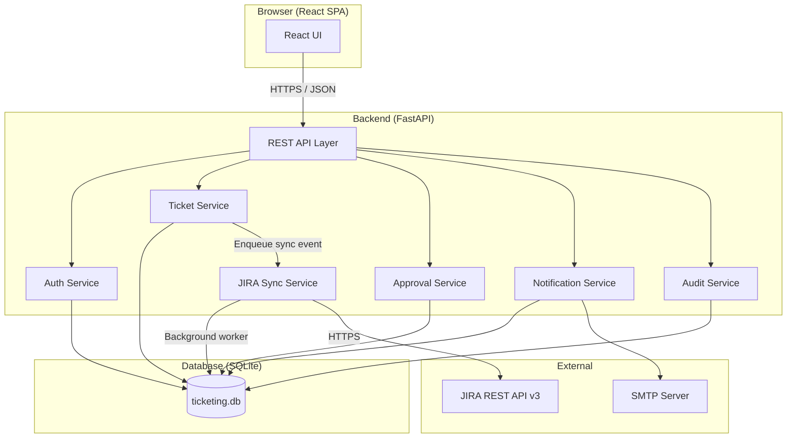
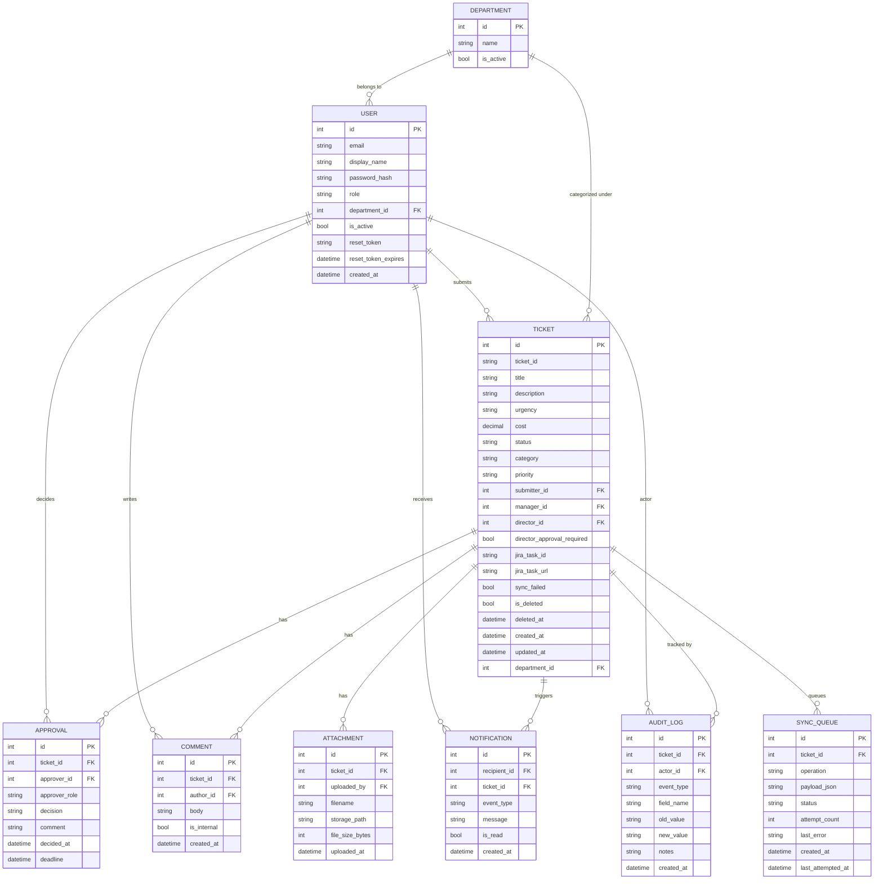
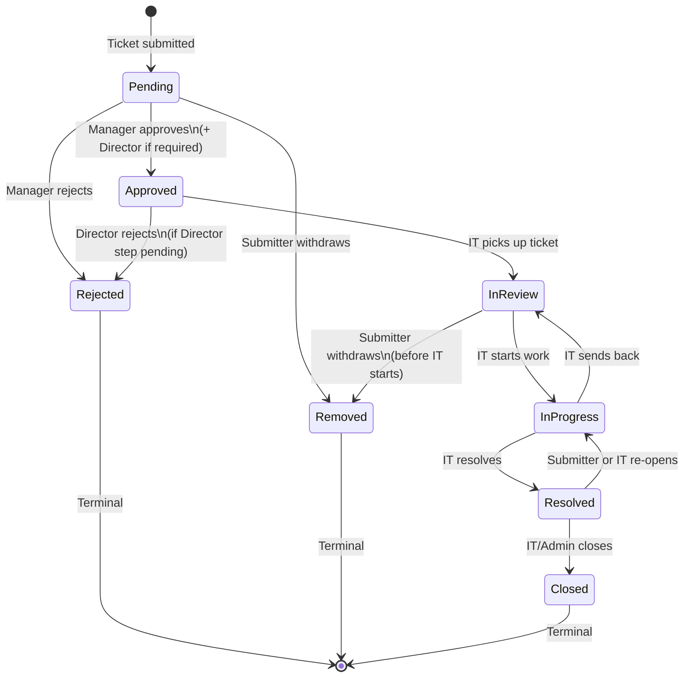
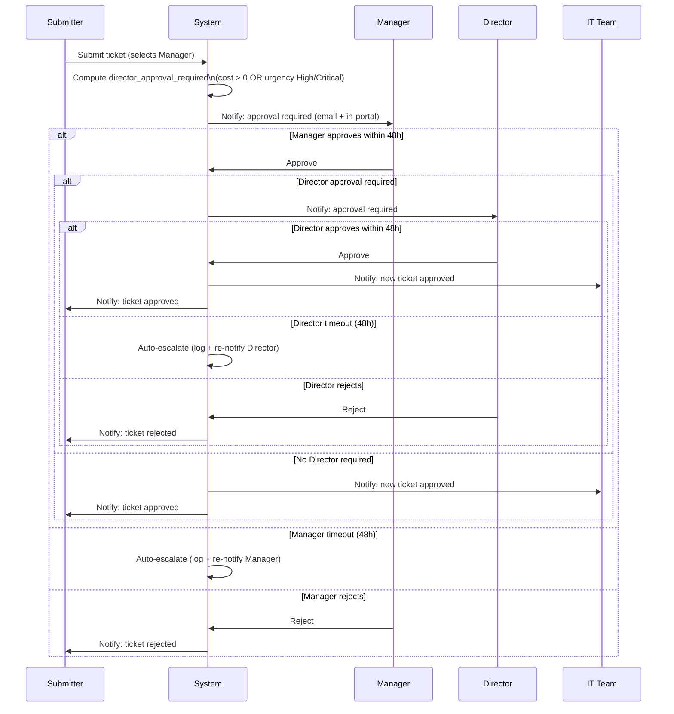
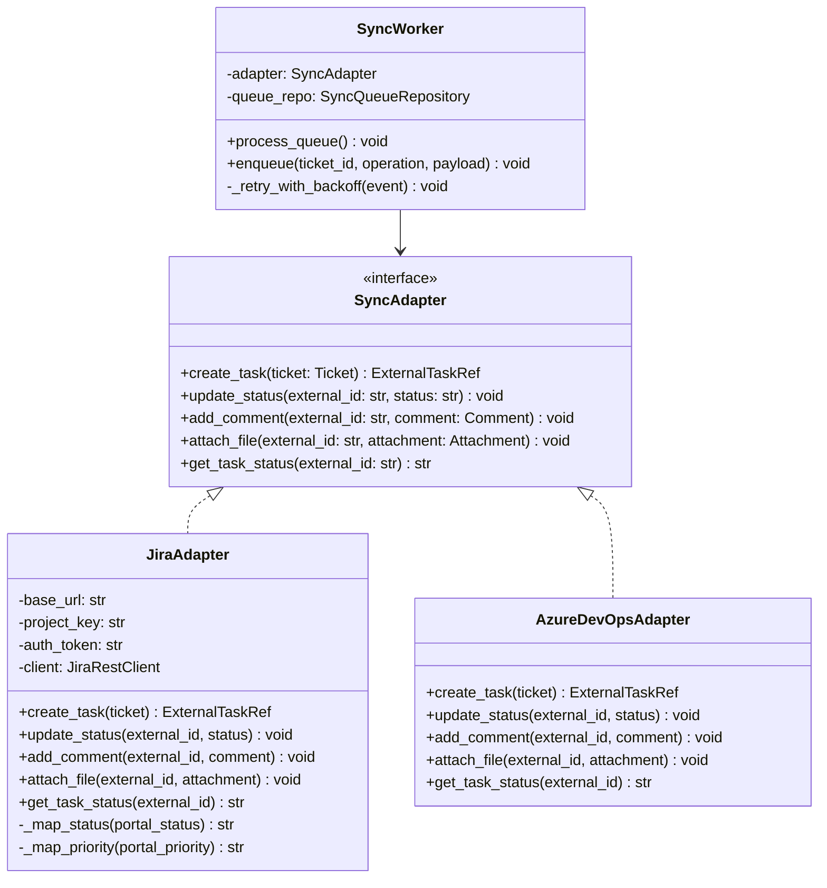

# Design Document: Internal Ticketing System

## Overview

The Internal Ticketing System is a locally hosted web portal that enables business users to submit, track, and manage service requests, with a two-tier approval workflow before tickets reach IT. Every approved ticket is automatically synchronized to a JIRA project ("Business_Backlog"), ensuring IT teams work from their existing tooling. The system supports five user roles with distinct permissions, a full ticket lifecycle with re-open capability, role-scoped dashboards, in-portal and email notifications, and a comprehensive audit trail.

**Tech Stack:**
- Frontend: React (React Router, Axios)
- Backend: Python / FastAPI
- Database: SQLite (local file)
- JIRA: REST API v3
- OS: Windows Server 2012 / Windows 11 Pro

---

## Architecture



**Key architectural decisions:**
- Single-process FastAPI application with an in-process background worker for JIRA sync (APScheduler or asyncio task queue). Keeps the PoC simple while remaining extractable to a separate service later.
- JIRA sync uses a pluggable adapter pattern (see JIRA Sync section) so Azure DevOps can be added without re-architecture.
- SQLite is sufficient for PoC single-user/small-team load; the ORM layer (SQLAlchemy) allows migration to PostgreSQL for production.
- All API routes are protected by JWT-based session tokens; the frontend stores the token in an httpOnly cookie.

---

## Components and Interfaces

### Frontend (React SPA)

| Component | Responsibility |
|---|---|
| `LoginPage` | Credential form, forgot-password link |
| `TicketListPage` | Role-scoped ticket list with filters |
| `TicketDetailPage` | Full ticket view: status, comments, history, JIRA link |
| `SubmitTicketPage` | Submission form (title, description, department, urgency, cost, manager, attachments) |
| `ApprovalQueuePage` | Manager / Director pending approvals |
| `AdminPage` | User management, department list, audit trail, system health |
| `DashboardPage` | Role-scoped summary counts and charts |
| `NotificationBell` | In-portal notification feed (bell icon) |
| `PasswordResetPage` | Request reset / set new password |

All API calls go through an Axios instance configured with the base URL and automatic JWT header injection. A 401 response triggers redirect to login.

### Backend API (FastAPI)

Organized into routers:
- `/auth` — login, logout, password reset
- `/tickets` — CRUD, status transitions, comments, attachments
- `/approvals` — approval/rejection actions
- `/users` — user management (Admin only)
- `/departments` — department list management (Admin only)
- `/notifications` — list/mark-read for in-portal feed
- `/audit` — audit trail queries (Admin only)
- `/sync` — sync health endpoint
- `/admin` — system health, soft-delete

### JIRA Sync Service

An in-process background worker that:
1. Polls a `sync_queue` table every 10 seconds for pending sync events.
2. Dispatches each event to the configured adapter (JIRA by default).
3. Retries failed events up to 3 times with exponential back-off.
4. Marks events as `failed` after exhausting retries and sets a `sync_failed` flag on the ticket.

### Notification Service

Handles both channels:
- **Email**: Uses Python `smtplib` / `email` to send plain-text emails with a direct ticket link.
- **In-portal**: Writes `Notification` rows to the database; the frontend polls `/notifications` on page focus.

### Audit Service

Every service method that mutates a ticket, approval, comment, or user record calls `AuditService.record(...)` which writes an immutable `AuditLog` row. No UPDATE or DELETE is ever issued against `audit_log`.

---

## Data Models

### Entity Relationship Diagram



### Key Field Notes

- `TICKET.urgency`: submitter-set field (Low / Medium / High / Critical). Separate from `priority` which is IT-assigned.
- `TICKET.director_approval_required`: computed at submission time — true if `cost > 0` OR `urgency IN ('High', 'Critical')`.
- `TICKET.status`: one of `Pending | Approved | In Review | In Progress | Resolved | Closed | Rejected | Removed`.
- `APPROVAL.approver_role`: `Manager` or `Director`. Sequential — Director row is only created after Manager approves.
- `APPROVAL.deadline`: set to `created_at + 48h`; a background job checks for expired approvals and auto-escalates.
- `COMMENT.is_internal`: when true, hidden from Business User, Manager, Director.
- `AUDIT_LOG`: append-only; no role may UPDATE or DELETE rows.
- `SYNC_QUEUE.status`: `pending | in_progress | success | failed`.

---

## Ticket Lifecycle State Machine



**Transition rules:**
- `Pending → Approved`: requires Manager approval (and Director approval if `director_approval_required = true`).
- `Pending → Rejected`: Manager rejects; ticket never reaches Director or IT.
- `Approved → Rejected`: Director rejects (only when Director step is pending).
- `Pending / In Review → Removed`: only the original submitter may trigger this.
- `Resolved → In Progress`: re-open; notifies IT team.
- `Closed`: terminal — no transitions out.
- IT Users may move tickets through `Approved → In Review → In Progress → Resolved → Closed`.
- IT Users may also override `priority` at any point (syncs to JIRA).

---

## Approval Flow



**Auto-escalation on 48h timeout:**
A background job (runs every 15 minutes) checks `APPROVAL` rows where `deadline < now()` and `decision IS NULL`. It logs an audit entry and re-sends the notification to the approver. For the PoC, escalation means re-notification; a production enhancement could route to a backup approver.

---

## API Endpoint Design

### Authentication

| Method | Path | Description | Roles |
|---|---|---|---|
| POST | `/auth/login` | Authenticate, return JWT cookie | Public |
| POST | `/auth/logout` | Invalidate session | Authenticated |
| POST | `/auth/password-reset/request` | Send reset email | Public |
| POST | `/auth/password-reset/confirm` | Set new password via token | Public |

### Tickets

| Method | Path | Description | Roles |
|---|---|---|---|
| GET | `/tickets` | List tickets (role-scoped) | All |
| POST | `/tickets` | Submit new ticket | Business User |
| GET | `/tickets/{id}` | Get ticket detail | Role-scoped |
| PATCH | `/tickets/{id}/status` | Update lifecycle status | IT, Admin |
| PATCH | `/tickets/{id}/category-priority` | Update category/priority | IT, Admin |
| DELETE | `/tickets/{id}` | Soft-delete (Closed/Rejected only) | Admin |
| POST | `/tickets/{id}/remove` | Submitter withdraws ticket | Submitter only |
| POST | `/tickets/{id}/reopen` | Re-open Resolved ticket | IT, Submitter |

### Comments

| Method | Path | Description | Roles |
|---|---|---|---|
| GET | `/tickets/{id}/comments` | List comments (internal filtered by role) | Role-scoped |
| POST | `/tickets/{id}/comments` | Add comment | Business User, IT, Admin |

### Attachments

| Method | Path | Description | Roles |
|---|---|---|---|
| POST | `/tickets/{id}/attachments` | Upload attachment (max 10MB) | Business User, IT |
| GET | `/tickets/{id}/attachments/{aid}` | Download attachment | Role-scoped |

### Approvals

| Method | Path | Description | Roles |
|---|---|---|---|
| GET | `/approvals/pending` | List pending approvals for current user | Manager, Director |
| POST | `/approvals/{id}/approve` | Approve ticket | Manager, Director |
| POST | `/approvals/{id}/reject` | Reject ticket with reason | Manager, Director |

### Users & Departments

| Method | Path | Description | Roles |
|---|---|---|---|
| GET | `/users` | List users | Admin |
| POST | `/users` | Create user | Admin |
| PATCH | `/users/{id}` | Update user (role, active) | Admin |
| GET | `/users/managers` | List managers (for submission dropdown) | Business User |
| GET | `/departments` | List departments | All |
| POST | `/departments` | Create department | Admin |
| PATCH | `/departments/{id}` | Update/deactivate department | Admin |

### Notifications

| Method | Path | Description | Roles |
|---|---|---|---|
| GET | `/notifications` | List unread notifications | Authenticated |
| POST | `/notifications/{id}/read` | Mark as read | Authenticated |
| POST | `/notifications/read-all` | Mark all as read | Authenticated |

### Audit & Admin

| Method | Path | Description | Roles |
|---|---|---|---|
| GET | `/audit/tickets/{id}` | Full audit trail for a ticket | Admin |
| GET | `/audit/log` | Filterable audit log | Admin |
| GET | `/sync/health` | Sync status, last sync time, pending retries | Admin, IT |

---

## JIRA Sync Adapter Pattern

The sync service uses an adapter interface so additional backends (Azure DevOps, ServiceNow) can be added without changing the core sync logic.



**JIRA-specific mappings:**

| Portal Status | JIRA Status |
|---|---|
| Pending | Pending |
| Approved | Approved |
| In Review | In Review |
| In Progress | In Progress |
| Resolved | Resolved |
| Closed | Closed |
| Rejected | Rejected |
| Removed | Removed |

| Portal Priority | JIRA Priority |
|---|---|
| Low | Low |
| Medium | Medium |
| High | High |
| Critical | Critical |

**JIRA project:** All tickets land in `Business_Backlog`. IT re-categorizes to the correct project bucket manually in JIRA.

**Sync flow:**
1. Ticket event (create / status change / comment / attachment) → `SyncWorker.enqueue(...)` writes a `SYNC_QUEUE` row.
2. Background worker polls every 10 seconds, picks up `pending` rows, calls `adapter.create_task(...)` or appropriate method.
3. On success: marks row `success`, stores `jira_task_id` on ticket.
4. On failure: increments `attempt_count`, schedules retry (10s → 30s → 90s back-off). After 3 failures: marks `failed`, sets `ticket.sync_failed = true`.
5. `GET /sync/health` returns last success timestamp and count of `failed` rows.

---

## Security Design

### Authentication

- **Mechanism**: JWT tokens stored in `httpOnly`, `Secure`, `SameSite=Strict` cookies. No localStorage.
- **Token lifetime**: 8 hours from last activity. Each authenticated request resets the expiry (sliding window).
- **Session invalidation**: Logout endpoint clears the cookie and adds the token JTI to a short-lived blocklist (in-memory dict for PoC, Redis for production).
- **Password hashing**: bcrypt, cost factor 12 minimum.
- **User provisioning**: Portal Admin creates accounts manually. No self-registration.

### Password Reset Flow

```
1. User submits email on /auth/password-reset/request
2. System generates a cryptographically random token (32 bytes, URL-safe base64)
3. Token stored as hash in USER.reset_token, expiry in USER.reset_token_expires (1 hour)
4. Email sent with link: https://<host>/reset-password?token=<raw_token>
5. User submits new password at /auth/password-reset/confirm with token + new password
6. System verifies token hash, checks expiry, updates password_hash, clears reset_token
```

### HTTPS

All traffic over HTTPS. For PoC on Windows, a self-signed certificate is acceptable. Uvicorn is configured with `ssl_keyfile` and `ssl_certfile`.

### Role Enforcement

Every API endpoint uses a FastAPI dependency (`Depends(require_role(...))`) that checks the JWT claims. Role hierarchy:

```
Portal Admin > IT User > Director > Manager > Business User
```

Endpoint-level enforcement is supplemented by service-layer checks (e.g., "only submitter can remove their own ticket").

### RBAC Matrix

| Action | Business User | Manager | Director | IT User | Portal Admin |
|---|---|---|---|---|---|
| Submit ticket | ✓ | ✓ | ✓ | ✓ | ✓ |
| View own tickets | ✓ | ✓ | ✓ | ✓ | ✓ |
| View dept tickets | — | ✓ | ✓ | ✓ | ✓ |
| View all tickets | — | — | — | ✓ | ✓ |
| Add public comment | ✓ | ✓ | ✓ | ✓ | ✓ |
| Add internal comment | — | — | — | ✓ | ✓ |
| View internal comment | — | — | — | ✓ | ✓ |
| Approve/reject ticket | — | ✓ (Manager) | ✓ (Director) | — | — |
| Remove own ticket | ✓ | ✓ | ✓ | — | — |
| Update status | — | — | — | ✓ | ✓ |
| Update category/priority | — | — | — | ✓ | ✓ |
| Soft-delete ticket | — | — | — | — | ✓ |
| Manage users | — | — | — | — | ✓ |
| Manage departments | — | — | — | — | ✓ |
| View audit trail | — | — | — | — | ✓ |
| View sync health | — | — | — | ✓ | ✓ |
| View system health | — | — | — | — | ✓ |

---

## Notification Design

### Events and Recipients

| Event | Email Recipients | In-Portal Recipients |
|---|---|---|
| Ticket submitted | Manager (+ Director if required) | Manager (+ Director if required) |
| Manager approves (Director required) | Director | Director |
| Ticket fully approved | IT team + Submitter | IT team + Submitter |
| Ticket rejected | Submitter | Submitter |
| Status changed | Submitter | Submitter |
| IT adds comment | Submitter | Submitter |
| Submitter adds comment | IT team | IT team |
| Ticket re-opened | IT team | IT team |
| Approval timeout (48h) | Approver (re-notification) | Approver |

### Email Format

Plain text. Example:

```
Subject: [Ticket #TKT-0042] Status changed to In Progress

Hello Jane,

Your ticket "New laptop request" (TKT-0042) has been updated.

New status: In Progress

View your ticket: https://<host>/tickets/42

This is an automated message from the Internal Ticketing Portal.
```

### In-Portal Notification Feed

- `NotificationBell` component polls `GET /notifications` every 30 seconds (or on window focus).
- Unread count shown as badge on bell icon.
- Clicking opens a dropdown list of recent notifications with timestamp and ticket link.
- "Mark all read" button available.

### Notification Service Implementation

```python
class NotificationService:
    def notify(self, event_type: str, ticket: Ticket, recipients: list[User]):
        for user in recipients:
            # Write in-portal notification row
            db.add(Notification(recipient_id=user.id, ticket_id=ticket.id,
                                event_type=event_type, message=...))
            # Send email asynchronously (fire-and-forget for PoC)
            send_email_async(to=user.email, subject=..., body=...)
```

Email sending failures are logged but do not block the main request flow.

---

## Error Handling

| Scenario | Handling |
|---|---|
| JIRA API unavailable | Sync event queued; portal continues normally; `sync_failed` flag set after retries exhausted |
| SMTP unavailable | Email failure logged; in-portal notification still created |
| Invalid status transition | 422 Unprocessable Entity with descriptive message |
| Unauthorized action | 403 Forbidden |
| Ticket not found | 404 Not Found |
| Attachment > 10MB | 413 Request Entity Too Large |
| Approval deadline exceeded | Background job logs audit entry, re-notifies approver |
| Concurrent status update | Optimistic locking via `updated_at` check; 409 Conflict if stale |
| Database error | 500 Internal Server Error; error logged with stack trace |
| Reset token expired | 400 Bad Request with "Token expired" message |

---

## Correctness Properties

*A property is a characteristic or behavior that should hold true across all valid executions of a system — essentially, a formal statement about what the system should do. Properties serve as the bridge between human-readable specifications and machine-verifiable correctness guarantees.*

### Property 1: Ticket submission creates a persisted ticket

*For any* valid ticket submission payload (non-empty title, non-empty description, valid department, valid urgency, valid manager), submitting the form SHALL result in a ticket being retrievable from the database with the same title, description, department, urgency, and a status of "Pending".

**Validates: Requirements FR-1.2, FR-5.3**

### Property 2: Empty/whitespace title or description is rejected

*For any* submission payload where the title or description is empty or composed entirely of whitespace characters, the system SHALL reject the submission and the total ticket count SHALL remain unchanged.

**Validates: Requirements FR-1.4**

### Property 3: Director approval requirement is correctly computed

*For any* ticket submission, the `director_approval_required` flag SHALL be true if and only if `cost > 0` OR `urgency` is "High" or "Critical". For all other combinations, the flag SHALL be false.

**Validates: Requirements (approval flow — Director trigger rules)**

### Property 4: Status transitions respect the lifecycle

*For any* ticket in a given status, only valid next-state transitions SHALL be accepted. Specifically: a ticket in "Closed", "Rejected", or "Removed" status SHALL reject any further status-change request.

**Validates: Requirements FR-3.2**

### Property 5: Audit log is append-only

*For any* sequence of ticket mutations (status changes, field updates, comment additions), the audit log entry count SHALL be monotonically non-decreasing. No mutation operation SHALL reduce the count of audit log entries for a ticket.

**Validates: Requirements AR-1.3**

### Property 6: Internal comments are hidden from non-IT roles

*For any* comment marked `is_internal = true`, the comment SHALL NOT appear in the response of `GET /tickets/{id}/comments` for any user whose role is Business User, Manager, or Director.

**Validates: Requirements (internal comment visibility)**

### Property 7: Soft-delete restricts visibility without data loss

*For any* ticket that has been soft-deleted, the ticket SHALL NOT appear in any list or detail endpoint response for Business User, Manager, Director, or IT User roles. The ticket data SHALL remain in the database and SHALL be accessible to Portal Admin.

**Validates: Requirements (soft-delete behavior)**

### Property 8: Approval sequence is strictly ordered

*For any* ticket where `director_approval_required = true`, the Director approval row SHALL NOT be created (and the Director SHALL NOT be notified) until the Manager has recorded an "approved" decision. The Manager approval SHALL always precede the Director approval.

**Validates: Requirements (sequential approval flow)**

### Property 9: Comment round-trip preserves content and authorship

*For any* comment submitted to a ticket, retrieving the ticket's comment list SHALL return a comment with the identical body text, the correct author identity, and a non-null timestamp.

**Validates: Requirements FR-2.4**

### Property 10: Ticket list is role-scoped

*For any* authenticated user, the ticket list returned by `GET /tickets` SHALL contain only tickets the user is authorized to see: Business Users see only their own tickets; Managers and Directors see only tickets from their department; IT Users and Admins see all tickets.

**Validates: Requirements FR-2.1, FR-3.1, FR-4.4, FR-4.5**

---

## Testing Strategy

### Unit Tests

Focus on specific examples, edge cases, and pure logic:
- Ticket validation logic (empty fields, field length limits)
- `director_approval_required` computation for all urgency/cost combinations
- Status transition guard — valid and invalid transitions
- Password hashing and verification
- JWT token generation and expiry
- JIRA status/priority mapping functions
- Notification message formatting
- Audit log entry construction

### Property-Based Tests

Use [Hypothesis](https://hypothesis.readthedocs.io/) (Python PBT library). Each property test runs a minimum of 100 iterations.

Each test is tagged with a comment referencing the design property:
```python
# Feature: internal-ticketing-system, Property 1: Ticket submission creates a persisted ticket
```

Properties to implement as Hypothesis tests:
- **Property 1**: Generate random valid ticket payloads → verify persisted ticket matches input and status is "Pending"
- **Property 2**: Generate strings of whitespace/empty → verify submission is rejected and ticket count unchanged
- **Property 3**: Generate all combinations of urgency × cost (0 / >0) → verify `director_approval_required` flag
- **Property 4**: Generate random status values → verify only valid transitions are accepted from each state
- **Property 5**: Generate sequences of ticket mutations → verify audit log count never decreases
- **Property 6**: Generate random comments with `is_internal=True` → verify non-IT roles cannot see them
- **Property 7**: Soft-delete a random ticket → verify it disappears from non-Admin list endpoints
- **Property 8**: Generate tickets with `director_approval_required=True` → verify Director row absent until Manager approves
- **Property 9**: Generate random comment bodies and authors → verify round-trip preserves content and authorship
- **Property 10**: Generate random users of each role → verify ticket list contains only authorized tickets

### Integration Tests

Example-based tests against a real SQLite test database:
- End-to-end ticket submission → JIRA sync (using a mock JIRA adapter)
- Full approval flow: Manager approve → Director approve → IT status updates
- Password reset flow: request → email token → confirm new password
- Notification delivery: verify `Notification` rows created for each event type
- Sync retry logic: simulate JIRA API failure → verify retry count increments → verify `sync_failed` flag after exhaustion

### Smoke Tests

Single-execution checks:
- Application starts and `/sync/health` returns 200
- Database migrations run without error on a fresh SQLite file
- JIRA adapter can authenticate with configured credentials
