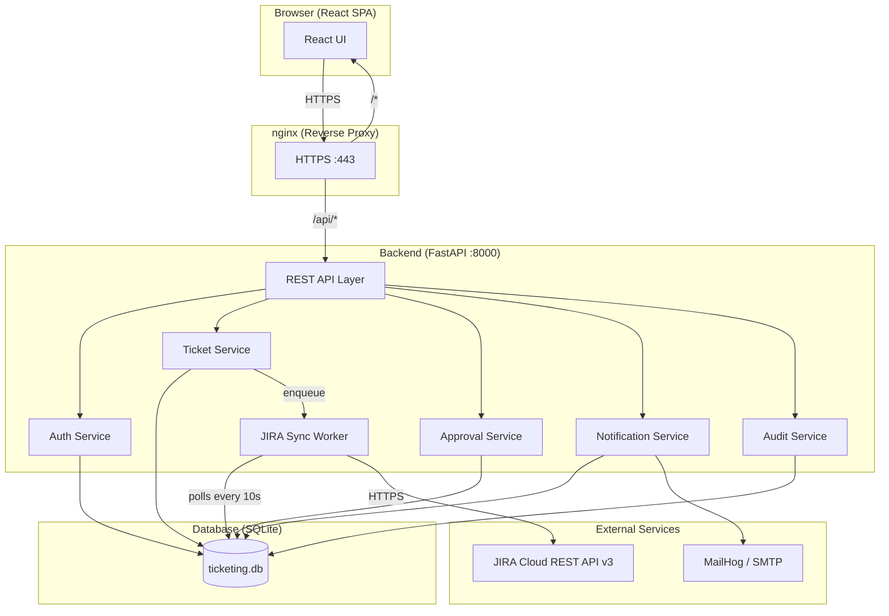
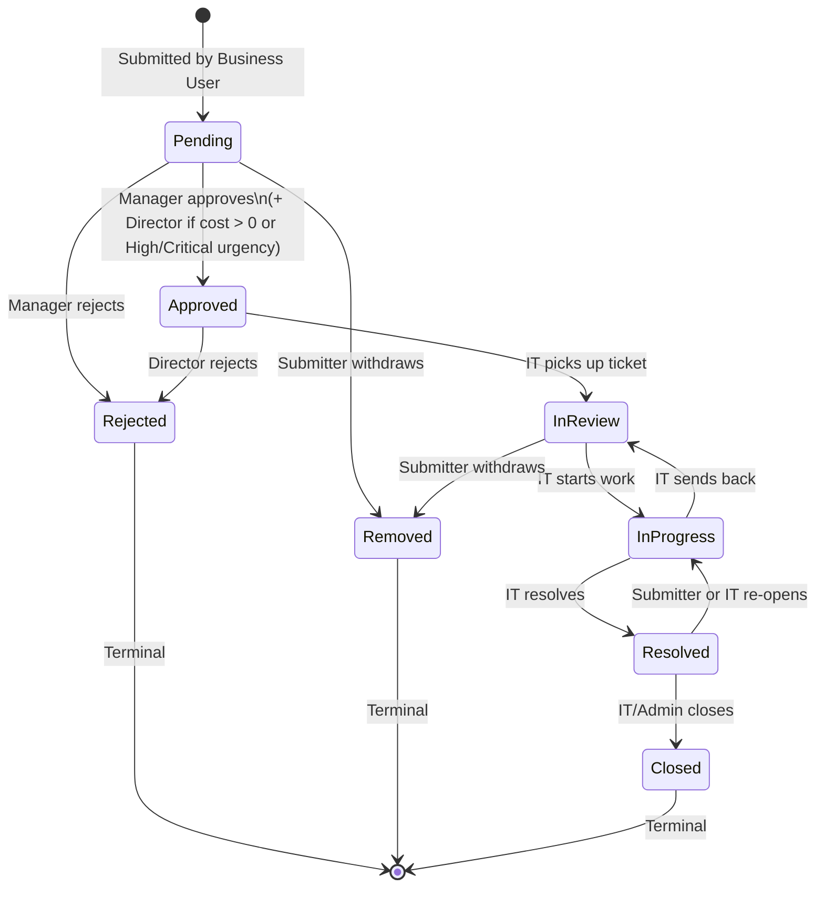
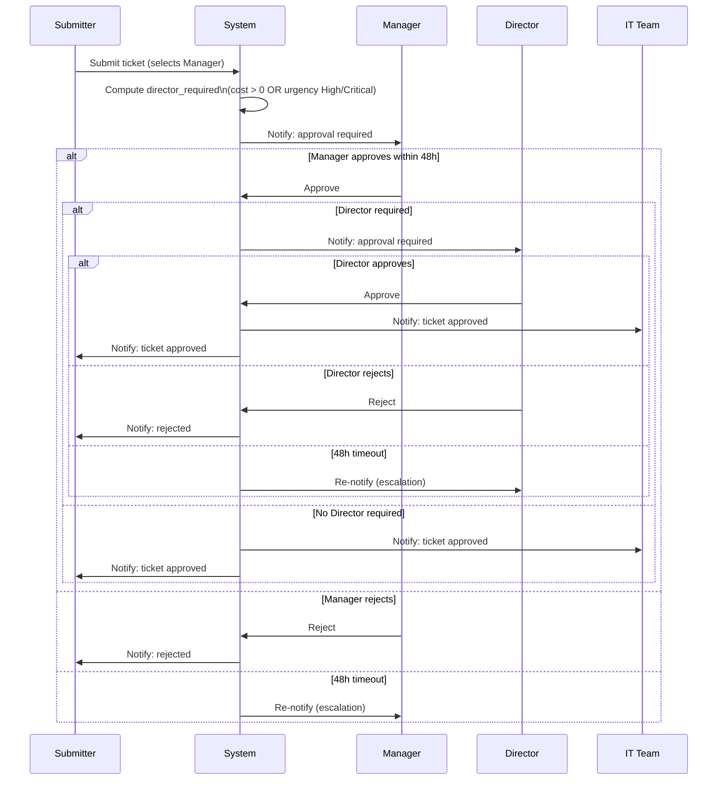
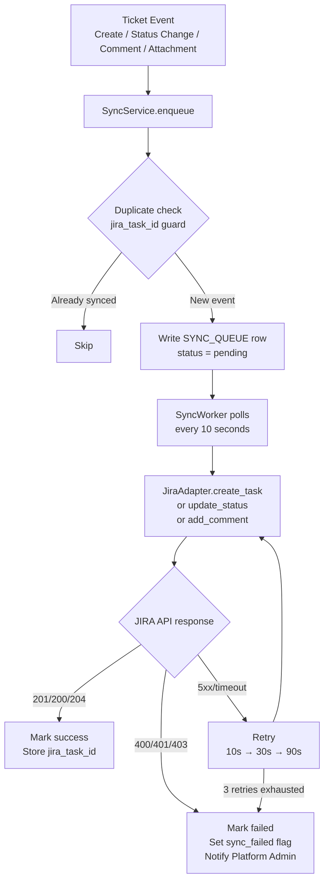
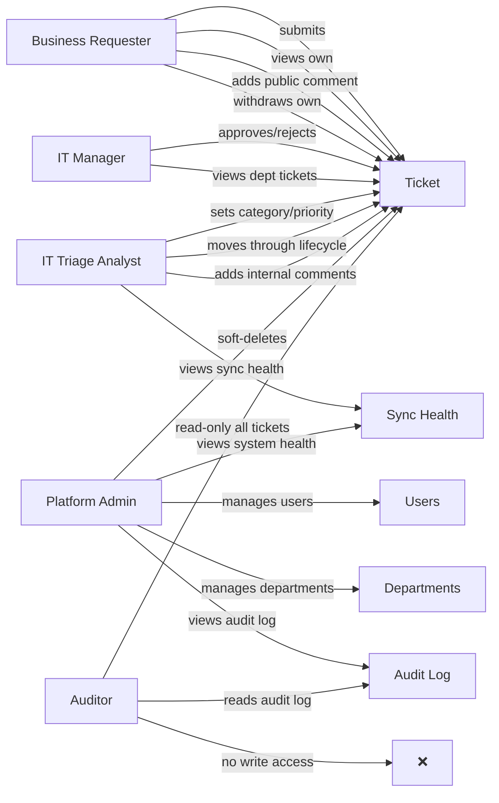

# Internal Ticketing System — PoC

A locally hosted internal ticketing portal for business users to submit service and business requests. Requests are visible in the portal and automatically create tasks in JIRA. Business users track status, comments, and history. IT users review, categorise, prioritise, and manage the full request lifecycle.

Built with **React + TypeScript** (frontend), **Python FastAPI** (backend), **SQLite** (database), and **nginx** (reverse proxy).

---

## Table of Contents

1. [Architecture](#architecture)
2. [Ticket Lifecycle](#ticket-lifecycle)
3. [Approval Workflow](#approval-workflow)
4. [JIRA Sync Flow](#jira-sync-flow)
5. [User Roles & Permissions](#user-roles--permissions)
6. [Project Structure](#project-structure)
7. [Prerequisites](#prerequisites)
8. [Local Setup — macOS](#local-setup--macos)
9. [Local Setup — Windows](#local-setup--windows)
10. [Seeding Test Users](#seeding-test-users)
11. [Running Automated Tests](#running-automated-tests)
12. [Manual Smoke Test Checklist](#manual-smoke-test-checklist)
13. [Switching to Real JIRA](#switching-to-real-jira)
14. [Stopping & Restarting](#stopping--restarting)
15. [Spec Documents](#spec-documents)
16. [Prompts Used to Build This](#prompts-used-to-build-this)

---

## Architecture



### Layer Responsibilities

| Layer | Path | Responsibility |
|---|---|---|
| API | `backend/app/api/` | HTTP routing, request parsing, response serialisation only |
| Domain | `backend/app/domain/` | Pure business rules — no I/O, no framework imports |
| Services | `backend/app/services/` | Orchestration between domain, repositories, adapters |
| Repositories | `backend/app/repositories/` | SQLAlchemy queries only |
| Adapters | `backend/app/adapters/` | JIRA, SMTP, mock integrations |
| Workers | `backend/app/workers/` | Background sync queue + approval timeout jobs |

---

## Ticket Lifecycle



**Rules:**
- `Closed` is terminal — no re-opening
- Only the submitter can mark a ticket as `Removed`
- Director approval is triggered automatically when `cost > 0` OR `urgency` is High/Critical
- Approval is sequential: Manager first, then Director (if required)

---

## Approval Workflow



---

## JIRA Sync Flow



**Adapter pattern** — JIRA is the default. Azure DevOps can be added by implementing `SyncAdapter` interface and setting `SYNC_ADAPTER=azure_devops`.

---

## User Roles & Permissions



| Action | Business Requester | IT Manager | IT Triage | Platform Admin | Auditor |
|---|:---:|:---:|:---:|:---:|:---:|
| Submit ticket | ✓ | ✓ | ✓ | ✓ | ✗ |
| View own tickets | ✓ | ✓ | ✓ | ✓ | — |
| View all tickets | ✗ | ✗ | ✓ | ✓ | ✓ |
| Approve/reject | ✗ | ✓ | ✗ | ✗ | ✗ |
| Update status | ✗ | ✗ | ✓ | ✓ | ✗ |
| Internal comments | ✗ | ✗ | ✓ | ✓ | ✓ (read) |
| Audit log | ✗ | ✗ | ✗ | ✓ | ✓ |
| Manage users | ✗ | ✗ | ✗ | ✓ | ✗ |
| Soft-delete | ✗ | ✗ | ✗ | ✓ | ✗ |

---

## Project Structure

```
├── backend/
│   ├── app/
│   │   ├── api/              # HTTP routers
│   │   ├── domain/           # Pure business logic
│   │   │   ├── enums.py      # TicketStatus, UserRole, etc.
│   │   │   ├── ticket_lifecycle.py   # VALID_TRANSITIONS table
│   │   │   ├── approval_rules.py     # requires_director_approval()
│   │   │   ├── exceptions.py         # Domain exceptions
│   │   │   └── interfaces.py         # SyncAdapter ABC
│   │   ├── services/         # Orchestration
│   │   ├── repositories/     # Data access
│   │   ├── adapters/         # JIRA, SMTP, mock, Azure DevOps stub
│   │   ├── models/           # SQLAlchemy ORM models
│   │   ├── schemas/          # Pydantic schemas
│   │   ├── core/             # Config, security, middleware
│   │   ├── db/               # Engine, session, init
│   │   └── workers/          # Sync queue + approval timeout
│   ├── tests/
│   │   ├── unit/             # Pure logic tests
│   │   ├── integration/      # API tests (in-memory SQLite)
│   │   └── property/         # Hypothesis property-based tests
│   ├── pyproject.toml
│   ├── Dockerfile
│   └── .env.example
├── frontend/
│   └── src/
│       ├── api/              # Axios API client
│       ├── components/       # AuthGuard, StatusBadge, NotificationBell
│       ├── context/          # AuthContext
│       ├── hooks/            # useAuth, usePermissions, useNotifications
│       ├── layouts/          # BusinessLayout, ITLayout
│       ├── pages/            # Route-level pages
│       │   ├── business/     # TicketListPage, SubmitTicketPage
│       │   ├── it/           # ITTicketListPage, DashboardPage
│       │   ├── admin/        # AdminPage, UserManagement, AuditLogView
│       │   └── shared/       # TicketDetailPage, CommentThread, StatusTimeline
│       ├── types/            # TypeScript domain types
│       └── utils/            # ticketLifecycle.ts
├── nginx/
│   ├── nginx.conf            # HTTPS termination + reverse proxy
│   └── certs/                # TLS certs (not committed — generate locally)
├── .kiro/
│   ├── specs/internal-ticketing-system/
│   │   ├── requirements.md   # Full requirements with PoC/Production tags
│   │   ├── design.md         # Architecture, data models, API design
│   │   └── tasks.md          # Implementation task list
│   └── steering/             # Kiro coding standards
├── docker-compose.yml
├── .env.example
└── README.md
```

---

## Prerequisites

| Tool | macOS | Windows |
|---|---|---|
| Docker Desktop | [docker.com/products/docker-desktop](https://www.docker.com/products/docker-desktop/) | Same |
| openssl | Pre-installed | Git Bash includes it, or install via [Win32 OpenSSL](https://slproweb.com/products/Win32OpenSSL.html) |
| Git | Pre-installed | [git-scm.com](https://git-scm.com/) |

---

## Local Setup — macOS

### Step 1: Clone the repo

```bash
git clone https://github.com/tkbsmanian/PoC-Ticketing.git
cd PoC-Ticketing
```

### Step 2: Generate TLS certificate

```bash
mkdir -p nginx/certs
openssl req -x509 -nodes -days 365 -newkey rsa:2048 \
  -keyout nginx/certs/key.pem \
  -out nginx/certs/cert.pem \
  -subj "/CN=localhost"
```

### Step 3: Configure environment

```bash
cp backend/.env.example backend/.env
```

Generate and set the secret key in one command:

```bash
SECRET=$(openssl rand -hex 32) && sed -i '' "s/CHANGE_ME_generate_with_openssl_rand_hex_32/$SECRET/" backend/.env
```

Set placeholder JIRA values (required even when using mock adapter):

```bash
sed -i '' 's|JIRA_BASE_URL=.*|JIRA_BASE_URL=https://placeholder.atlassian.net|' backend/.env
sed -i '' 's|JIRA_USER_EMAIL=.*|JIRA_USER_EMAIL=placeholder@example.com|' backend/.env
sed -i '' 's|JIRA_API_TOKEN=.*|JIRA_API_TOKEN=placeholder-token|' backend/.env
```

### Step 4: Start Docker

```bash
docker compose up --build -d
```

### Step 5: Verify all services are running

```bash
docker compose ps
```

All four services should show `running`: `backend`, `frontend`, `nginx`, `mailhog`.

### Step 6: Open the portal

Go to **https://localhost** — click **Advanced → Proceed to localhost** to accept the self-signed cert.

---

## Local Setup — Windows

### Step 1: Clone the repo

Open **Git Bash** or **PowerShell**:

```bash
git clone https://github.com/tkbsmanian/PoC-Ticketing.git
cd PoC-Ticketing
```

### Step 2: Generate TLS certificate

In Git Bash:

```bash
mkdir -p nginx/certs
openssl req -x509 -nodes -days 365 -newkey rsa:2048 \
  -keyout nginx/certs/key.pem \
  -out nginx/certs/cert.pem \
  -subj "/CN=localhost"
```

### Step 3: Configure environment

```bash
cp backend/.env.example backend/.env
```

Open `backend/.env` in Notepad or VS Code and:
1. Replace `CHANGE_ME_generate_with_openssl_rand_hex_32` with output of: `openssl rand -hex 32`
2. Set these values:
```dotenv
JIRA_BASE_URL=https://placeholder.atlassian.net
JIRA_USER_EMAIL=placeholder@example.com
JIRA_API_TOKEN=placeholder-token
SYNC_ADAPTER=mock
```

### Step 4: Start Docker

In PowerShell or Git Bash:

```bash
docker compose up --build -d
```

### Step 5: Open the portal

Go to **https://localhost** in Chrome or Edge — click **Advanced → Proceed to localhost**.

> **Windows note:** If port 443 is blocked by another service, stop IIS or change the nginx port in `docker-compose.yml`.

---

## Seeding Test Users

After Docker is running, seed all test users with one command:

```bash
docker compose exec backend python -c "
from app.db.session import SessionLocal
from app.db.init_db import init_db
from app.models.user import UserModel, DepartmentModel
from app.core.security import hash_password
init_db()
db = SessionLocal()
dept = DepartmentModel(name='IT', is_active=True)
db.add(dept)
db.commit()
users = [
    ('admin@test.com', 'Platform Admin', 'platform_admin'),
    ('manager@test.com', 'Jane Manager', 'it_manager'),
    ('it@test.com', 'IT Triage', 'it_triage'),
    ('user@test.com', 'Business User', 'business_user'),
    ('auditor@test.com', 'Auditor', 'auditor'),
]
for email, name, role in users:
    u = UserModel(email=email, display_name=name, password_hash=hash_password('Test123!'), role=role, department_id=dept.id, is_active=True)
    db.add(u)
db.commit()
print('All users created — password: Test123!')
"
```

| Role | Email | Password |
|---|---|---|
| Platform Admin | admin@test.com | Test123! |
| IT Manager | manager@test.com | Test123! |
| IT Triage | it@test.com | Test123! |
| Business User | user@test.com | Test123! |
| Auditor | auditor@test.com | Test123! |

---

## Running Automated Tests

### Backend — unit tests

```bash
cd backend
python3 -m venv .venv
source .venv/bin/activate        # macOS/Linux
# .venv\Scripts\activate         # Windows
pip install -e ".[dev]"
pytest tests/unit -v
```

### Backend — integration tests

```bash
pytest tests/integration -v
```

### Backend — property-based tests (Hypothesis)

```bash
pytest tests/property -v
```

### Backend — all tests with coverage

```bash
pytest tests/unit tests/integration --cov=app --cov-report=term-missing
```

### Frontend tests

```bash
cd frontend
npm install
npm test
```

---

## Manual Smoke Test Checklist

### Business User Flow (`user@test.com`)

- [ ] Log in → redirected to `/portal/tickets`
- [ ] My Requests page shows empty state
- [ ] Click **Submit Request** → form loads with all fields
- [ ] Submit with empty title → inline validation error appears
- [ ] Submit valid request → confirmation shows with Ticket ID (e.g. `TKT-A1B2C3D4`)
- [ ] Ticket appears in My Requests list with status `Pending`
- [ ] Click ticket → detail page shows description, urgency, status timeline
- [ ] Add a public comment → comment appears in thread
- [ ] Cannot see IT Actions panel
- [ ] Cannot update status or category

### Manager Approval Flow (`manager@test.com`)

- [ ] Log in → **Approvals** nav item visible
- [ ] Pending approval appears in queue
- [ ] Click **Reject** with a reason → submitter's ticket shows `Rejected`
- [ ] Submit another ticket as business user (Low urgency, no cost)
- [ ] Log back in as manager → **Approve** the ticket
- [ ] Ticket status changes to `Approved`
- [ ] Submit a ticket with cost > 0 → after Manager approves, Director approval step appears

### IT Triage Flow (`it@test.com`)

- [ ] Log in → redirected to `/it/tickets`
- [ ] Ticket Queue shows all tickets across all users
- [ ] Filter by status `Approved` → only approved tickets shown
- [ ] Open approved ticket → **IT Actions** panel visible
- [ ] Set Category (e.g. `Hardware`) and Priority (e.g. `High`) → saves
- [ ] Move ticket: `Approved → In Review` → status updates
- [ ] Move ticket: `In Review → In Progress` → status updates
- [ ] Add **internal comment** (check "Internal note" toggle) → visible to IT
- [ ] Log in as business user → internal comment NOT visible
- [ ] Move ticket: `In Progress → Resolved`
- [ ] Sync health dashboard shows `adapter: mock`, no failures

### Platform Admin Flow (`admin@test.com`)

- [ ] Log in → **Admin** tab visible in IT portal
- [ ] **Users** tab → list of all users loads
- [ ] Create a new user → appears in list
- [ ] Deactivate a user → shows as inactive
- [ ] **Departments** tab → add a new department
- [ ] **Audit Log** tab → shows all events from above actions
- [ ] Open a Closed ticket → soft-delete option available
- [ ] Sync health visible with full details

### Auditor Flow (`auditor@test.com`)

- [ ] Log in → IT portal loads (read-only)
- [ ] Can view all tickets across all departments
- [ ] Can view Audit Log
- [ ] **Submit Request** button absent or returns 403
- [ ] Cannot add comments
- [ ] Cannot update status, category, or priority

### Notifications

- [ ] Open **http://localhost:8025** (MailHog)
- [ ] Submit a ticket as business user → email to manager appears in MailHog
- [ ] Manager approves → email to submitter and IT team appears
- [ ] IT updates status → email to submitter appears
- [ ] IT adds public comment → email to submitter appears
- [ ] Bell icon in portal shows unread count

---

## Switching to Real JIRA

1. Edit `backend/.env`:
```dotenv
SYNC_ADAPTER=jira
JIRA_BASE_URL=https://your-org.atlassian.net
JIRA_USER_EMAIL=service-account@your-org.com
JIRA_API_TOKEN=<token from id.atlassian.com>
JIRA_PROJECT_KEY=BB
JIRA_ISSUE_TYPE=Task
```

2. Ensure the JIRA service account has these permissions:
   - Browse projects
   - Create issues
   - Edit issues
   - Add comments
   - Create attachments

3. Restart the backend:
```bash
docker compose restart backend
```

4. Monitor sync health at **https://localhost/api/sync/health**

---

## Stopping & Restarting

```bash
# Stop (keeps all data in Docker volumes)
docker compose down

# Start again
docker compose up -d

# Stop and wipe all data
docker compose down -v

# View logs
docker compose logs backend --tail=50
docker compose logs nginx --tail=20
```

---

## Spec Documents

The full specification is in `.kiro/specs/internal-ticketing-system/`:

| File | Contents |
|---|---|
| `requirements.md` | Product brief, personas, functional/non-functional/integration/audit requirements tagged [PoC] vs [Production] |
| `design.md` | Architecture, data models, API endpoints, JIRA integration design, RBAC matrix, security design, end-to-end workflows, threat model |
| `tasks.md` | 90 implementation tasks across 10 epics |

Kiro steering rules (coding standards enforced during generation) are in `.kiro/steering/`:

| File | Enforces |
|---|---|
| `architecture.md` | Clean layer separation, import direction rules |
| `security.md` | bcrypt, JWT cookies, OWASP logging, input validation |
| `testing.md` | Test structure, coverage requirements, Hypothesis usage |
| `logging.md` | Structured JSON logging, what to log/not log |
| `integration-boundaries.md` | SyncAdapter interface, adapter isolation |
| `environment-config.md` | pydantic-settings, no hardcoded secrets |
| `domain-logic.md` | Pure domain functions, enum definitions, exception hierarchy |

---

## Prompts Used to Build This

This project was built entirely through conversational prompts with Kiro. Below are the key prompts in sequence:

**1. Initial brief**
> I want to build a local-hosted internal ticketing system PoC for business users to submit service/business requests. The requests should be visible in our new portal and also create pending tasks in JIRA for IT review. Business users must be able to track status, comments, and history in the new portal. IT users must be able to review, categorize, prioritize, and update the request lifecycle. Generate product brief with goals, non-goals, personas, assumptions, constraints, and success criteria for a PoC.

**2. Structured requirements**
> Turn this product brief into structured requirements and acceptance criteria. Separate functional requirements, non-functional requirements, integration requirements, reporting requirements, audit requirements, and future-phase requirements. Explicitly identify PoC only scope vs production scope.

**3. Clarifying questions**
> Before designing the system, ask me the top 25 clarifying questions (one by one) needed to remove ambiguity across workflow, Jira mapping, user roles, approvals, notifications, security, data retention, and reporting.

**4. Role and permission model**
> Define the user roles and permission model for the PoC. Includes Business Requester, IT Triage Analyst, IT Manager, Platform Admin, and Auditor. For each role, list allowed actions, prohibited actions, data visibility, and approval authority.

**5. JIRA integration design**
> Design the Jira (keeping Azure DevOps integration for scalability in mind) integration for this PoC. Assume Jira cloud. Propose how local tickets map to Jira issues, including project key, issue type, summary, description, labels, priority, attachments, comments, reporter, assignee, and status mapping. Also, define retry logic, idempotency, duplicate prevention, and failure handling.

**6. Database schema**
> Create the domain model and database schema for the PoC. Include tables/entities for users, roles, tickets, ticket categories, ticket priorities, comments, attachments, audit events, Jira sync events, status history, SLA targets, and notification events. Show relationships and suggested indexes.

**7. UX design**
> Design the user experience for two portals: Business portal and IT Operations portal. For each portal define navigation, main screens, ticket submission form, ticket details page, status timeline, conversation thread, search and filters, notifications, accessibility and usability requirements. Optimize for low training effort and clear status transparency.

**8. Security specification**
> Create a security requirements specification for this ticketing PoC. Include authentication, authorization, session management, secrets handling, encryption, input validation, file upload protection, audit logging, PII handling, least privilege, admin controls, rate limiting, and local-host deployment handling. Mark which controls are mandatory for the PoC and which can be deferred.

**9. Threat model**
> Perform a threat model for this system using STRIDE. Cover the web app, local backend, local database, file uploads, Jira integration, admin functions, and comment history. For each threat, list risk, impact, mitigation, and test cases.

**10. API design**
> Design the internal API for this application. Include endpoints for authentication, ticket creation, ticket updates, comments, attachments, status history, dashboard metrics, Jira sync, admin configurations, and audit retrieval. For each endpoint specify method, request schema, response schema, authorization, validation rules, and error handling.

**11. Kiro steering rules**
> Create Kiro steering rules for this repository. The project must enforce clean architecture, secure coding, test coverage, integration boundaries, environment-based configuration, no hardcoded secrets, structured logging, and explicit separation between domain logic and Jira integration logic.

**12. Implementation tasks**
> Break the approved design into an implementation plan with epics, stories, and sequenced engineering tasks, include dependencies, estimates, definition of done, and automated test expectations for each task. Separate must-have PoC tasks from nice-to-have tasks.

**13. Backend skeleton**
> Generate the backend project skeleton for this PoC using FastAPI and SQLite. Include modules for auth, tickets, comments, attachments, Jira integration, audit logging, background jobs, and admin settings. Add unit and integration test scaffolding.

**14. Frontend skeleton**
> Generate the frontend project skeleton for this PoC using React and TypeScript. Include layouts for business portal and IT portal, route structure, API client layer, auth guard, ticket list view, ticket detail view, submission form, and admin configuration screen.

**15. Execute all tasks**
> Are these requirements, designs and tasks enough to build the application now? If so, go ahead and start building it after your review.
